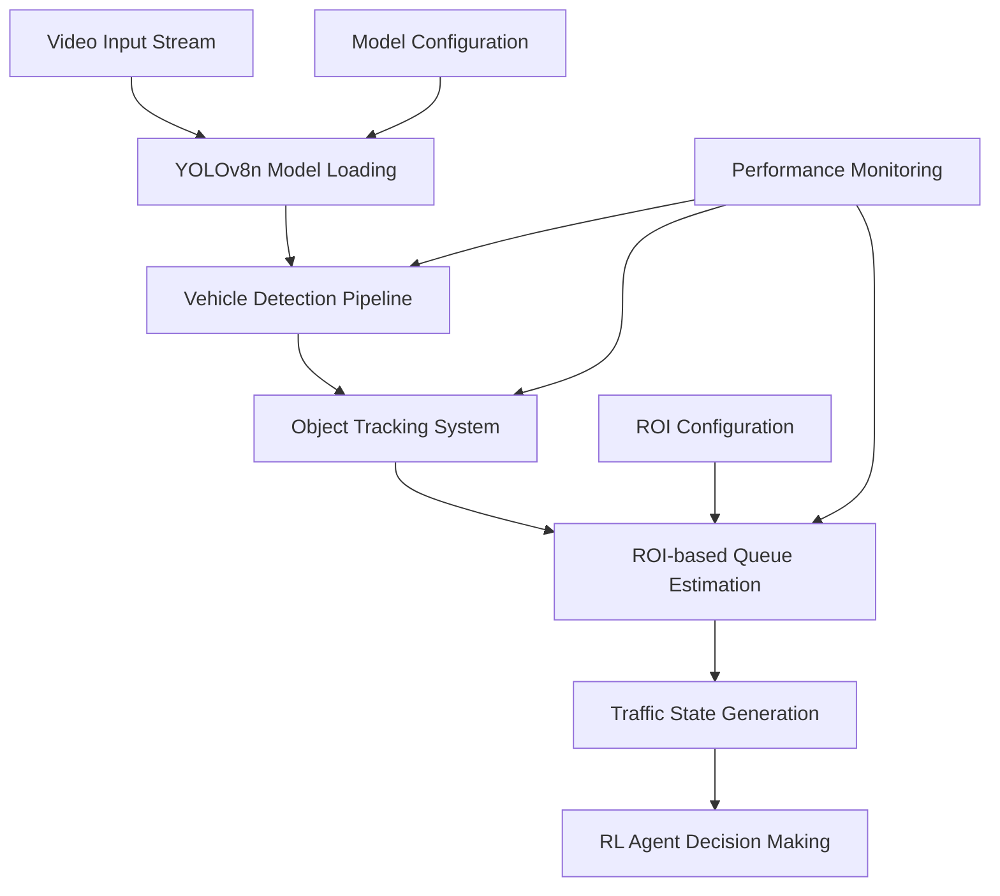
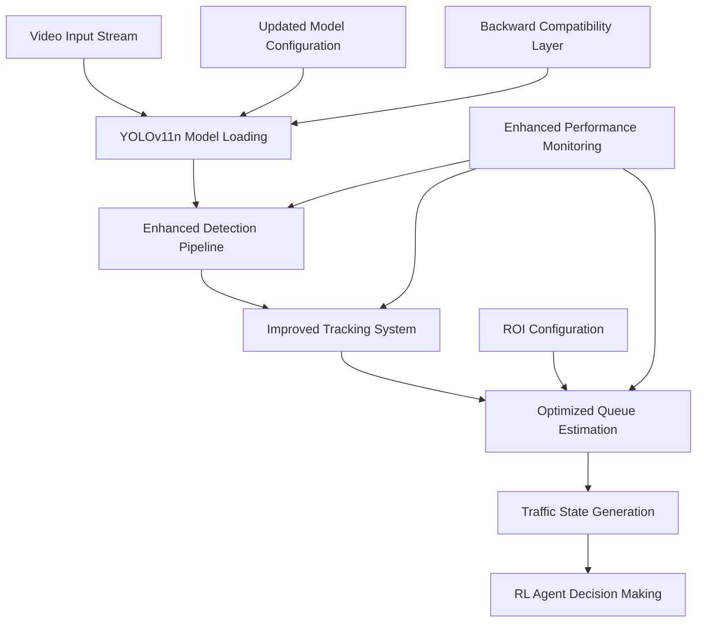
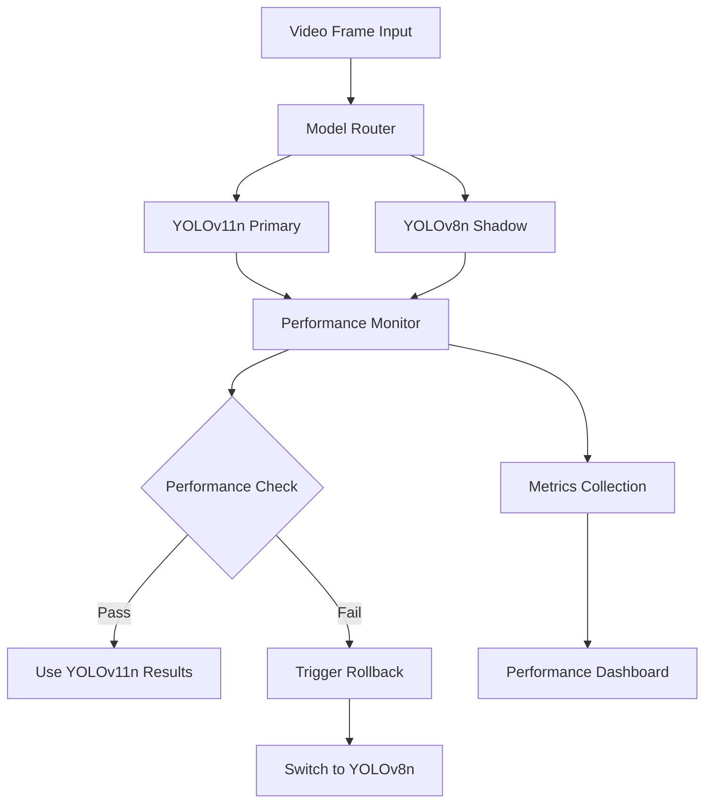
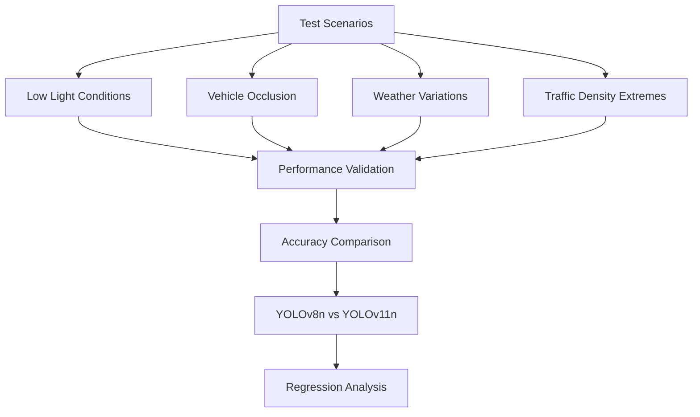
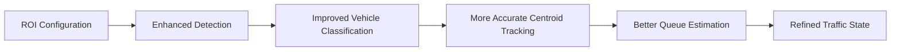
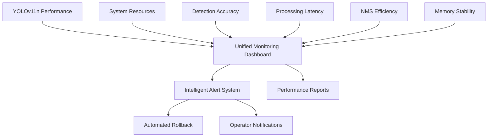
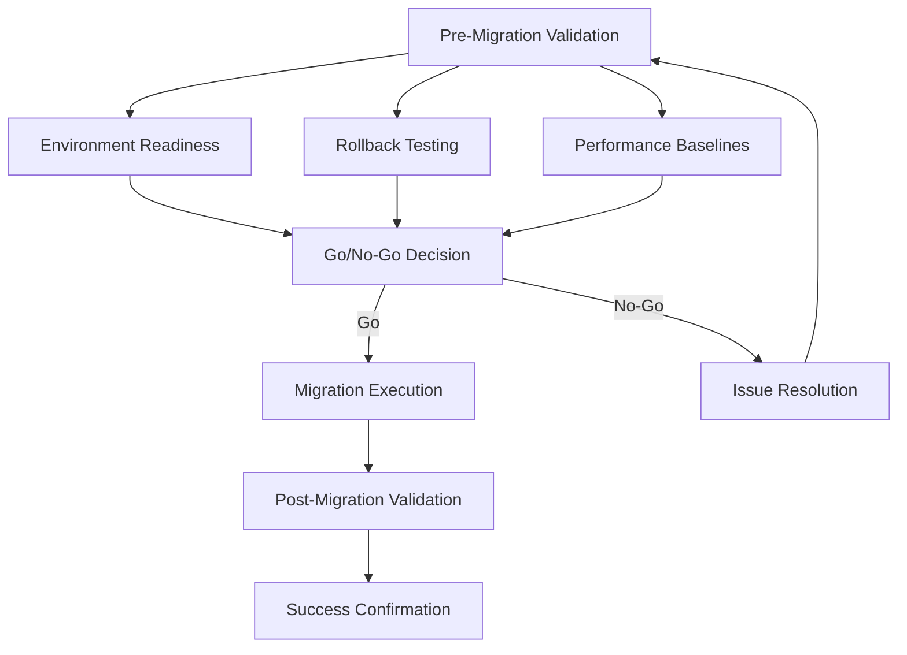

# Model Upgrade from YOLOv8n to YOLOv11n Design Document

## Overview

This design document outlines the strategic upgrade path from YOLOv8n to YOLOv11n in the adaptive traffic control system, ensuring compliance with NIST Cybersecurity Framework standards and maintaining system reliability throughout the transition.

### Purpose
The upgrade aims to leverage YOLOv11n's enhanced performance capabilities, improved inference speed, and better accuracy for real-time vehicle detection in traffic monitoring applications while maintaining backward compatibility and system stability.

### Scope
The upgrade encompasses all computer vision components within the adaptive traffic system, including:
- Core detection models and inference pipelines
- Vision processing configurations
- Performance monitoring systems
- Integration testing protocols
- Deployment validation procedures

## Architecture Impact Analysis

### Current YOLOv8n Implementation Architecture

The existing system utilizes YOLOv8n through the ultralytics framework with the following architectural components:

### Target YOLOv11n Architecture

The upgraded architecture maintains the same functional structure while enhancing performance characteristics:

## Component Design Specifications

### Model Integration Layer

#### YOLOv11n Model Adapter
| Component | Current State | Target State | Migration Strategy |
|-----------|---------------|--------------|-------------------|
| Model Loading | ultralytics.YOLO("yolov8n.pt") | ultralytics.YOLO("yolo11n.pt") | Gradual rollout with fallback |
| Model Path Configuration | Hardcoded yolov8n.pt references | Configurable model selection | Environment-based configuration |
| Download Mechanism | Auto-download YOLOv8n | Auto-download YOLOv11n | Version-aware download logic |
| Fallback Strategy | OpenCV DNN fallback | YOLOv8n → YOLOv11n → OpenCV DNN | Multi-tier fallback system |

### Enhanced Configuration Management System

The system implements a configuration-driven approach that leverages YOLOv11's API compatibility:

#### Model Configuration Strategy
| Configuration Element | Implementation Approach | Validation Method |
|----------------------|------------------------|-------------------|
| Model Version Selection | Environment variable driven | Runtime validation |
| Fallback Chain | Automated degradation path | Health check triggers |
| Performance Thresholds | Configurable monitoring | Real-time metrics |
| Rollback Automation | Threshold-based triggers | Automated response |

#### Dual-Model Validation Architecture

#### Simplified Model Loading Logic
The model loading system maintains backward compatibility while enabling seamless version switching:

| Loading Scenario | Primary Action | Fallback Action | Error Handling |
|------------------|----------------|-----------------|----------------|
| YOLOv11n Available | Load YOLOv11n model | N/A | Log success |
| YOLOv11n Unavailable | Attempt download | Load YOLOv8n | Log fallback |
| Both Unavailable | Download YOLOv11n | OpenCV DNN | Log error state |
| Download Failure | Use cached model | Manual intervention | Alert operators |

### Detection Pipeline Enhancement

#### Advanced Performance Optimization Strategy

| Optimization Area | YOLOv8n Baseline | YOLOv11n Target | Implementation Method |
|-------------------|------------------|-----------------|----------------------|
| Inference Speed | Current FPS measurement | 15-25% improvement | GPU memory optimization |
| Detection Accuracy | Current mAP scores | 5-10% improvement | Enhanced NMS efficiency |
| Memory Usage | Current baseline | Optimized allocation | Batch size calculation |
| Model Size | ~6MB | ~6MB | No storage impact |
| NMS Processing | Standard efficiency | Improved algorithm | Built-in optimization |
| Batch Processing | Current capability | Enhanced throughput | Dynamic batch sizing |

#### Resource Optimization Implementation
The upgrade incorporates advanced resource management for optimal performance:

| Resource Type | Optimization Strategy | Monitoring Method |
|---------------|----------------------|-------------------|
| GPU Memory | Dynamic batch size calculation | CUDA memory tracking |
| CPU Utilization | Multi-threading optimization | Process monitoring |
| Model Warmup | Optimized initialization | Startup time measurement |
| Memory Leaks | Automatic cleanup cycles | Long-term memory tracking |

#### Edge Case Validation Framework

#### Detection Configuration Parameters
The upgrade maintains existing parameter compatibility while introducing YOLOv11n-specific optimizations:

| Parameter | Current Default | Upgraded Default | Rationale |
|-----------|----------------|------------------|-----------|
| confidence_threshold | 0.5 | 0.5 | Maintain consistency |
| nms_threshold | 0.4 | 0.4 | Preserve filtering behavior |
| model_path | "yolov8n.pt" | "yolo11n.pt" | Version update |
| vehicle_classes | {2, 3, 5, 7} | {2, 3, 5, 7} | COCO compatibility maintained |

### Tracking System Compatibility

#### VehicleTracker Integration
The existing VehicleTracker class maintains full compatibility with YOLOv11n outputs:

- Detection format compatibility: YOLOv11n maintains the same output structure as YOLOv8n
- Centroid tracking algorithms: No modifications required
- Motion estimation: Existing velocity calculation methods remain valid
- Queue estimation logic: Stationary vehicle detection unchanged

#### ROI Processing Enhancement
Region of Interest processing leverages YOLOv11n improvements:

## System Integration Strategy

### Simplified Migration Workflow

#### Week 1: Compatibility Validation
1. **Environment Preparation**
   - Update ultralytics package to latest version
   - Verify YOLOv11n model availability and download
   - Execute comprehensive compatibility testing

2. **Shadow Mode Implementation**
   - Deploy dual-model validation system
   - Run YOLOv11n in parallel with YOLOv8n
   - Collect comparative performance metrics

#### Week 2: Shadow Deployment
1. **Production Shadow Testing**
   - Execute YOLOv11n alongside YOLOv8n in production
   - Use YOLOv8n results while logging YOLOv11n performance
   - Validate edge cases and environmental conditions

2. **Performance Analysis**
   - Analyze comparative metrics across different scenarios
   - Validate accuracy improvements and performance gains
   - Identify any anomalies or regression patterns

#### Week 3: Canary Deployment
1. **Controlled Traffic Split**
   - Route 10% of traffic processing to YOLOv11n
   - Maintain real-time monitoring and comparison
   - Implement automated rollback triggers

2. **Gradual Traffic Increase**
   - Incrementally increase YOLOv11n traffic percentage
   - Monitor system stability and performance metrics
   - Validate resource utilization patterns

#### Week 4: Full Production Rollout
1. **Complete Migration**
   - Switch 100% of traffic to YOLOv11n
   - Maintain YOLOv8n as hot standby for immediate rollback
   - Execute comprehensive system validation

2. **Post-Migration Optimization**
   - Remove YOLOv8n dependencies after stabilization period
   - Optimize system configuration for YOLOv11n-specific features
   - Update operational documentation and procedures

### Risk Mitigation Strategy

#### Technical Risk Assessment
| Risk Category | Impact Level | Mitigation Approach |
|---------------|--------------|-------------------|
| Model Compatibility Issues | High | Multi-tier fallback system |
| Performance Degradation | Medium | Extensive benchmarking and rollback capability |
| Integration Failures | Medium | Comprehensive testing suite |
| Dependency Conflicts | Low | Version pinning and isolated testing |

#### NIST Cybersecurity Framework Compliance

#### Identify (ID)
- **Asset Management**: Catalog all YOLOv11n model files and dependencies
- **Risk Assessment**: Evaluate security implications of model upgrade
- **Governance**: Establish clear ownership and accountability for upgrade process

#### Protect (PR)
- **Access Control**: Implement secure model download and validation mechanisms
- **Data Security**: Ensure model files are verified and integrity-checked
- **Configuration Management**: Maintain secure configuration practices

#### Detect (DE)
- **Continuous Monitoring**: Implement real-time performance monitoring
- **Anomaly Detection**: Monitor for unusual system behavior post-upgrade
- **Security Monitoring**: Track model file access and modifications

#### Respond (RS)
- **Response Planning**: Define rollback procedures for upgrade failures
- **Communications**: Establish clear communication channels for issues
- **Analysis**: Implement logging for upgrade-related events

#### Recover (RC)
- **Recovery Planning**: Define system recovery procedures
- **Improvements**: Document lessons learned from upgrade process
- **Communications**: Maintain stakeholder communication throughout recovery

## Testing Strategy

### Enhanced Testing Strategy

#### A/B Testing Implementation
The testing framework incorporates production traffic splitting and comparative analysis:

#### Comprehensive Validation Protocol
| Test Category | Coverage Scope | Success Criteria | Automation Level |
|---------------|----------------|------------------|------------------|
| API Compatibility | 100% existing interfaces | Zero breaking changes | Fully automated |
| Performance Benchmarking | All deployment scenarios | Meet target improvements | Automated with alerts |
| Edge Case Validation | Environmental conditions | Maintain accuracy thresholds | Semi-automated |
| Resource Utilization | Memory and GPU usage | Within acceptable limits | Continuous monitoring |
| Data Format Consistency | Output structure validation | Identical format compliance | Automated validation |

#### Automated Rollback System
The system implements intelligent rollback triggers based on performance thresholds:

| Trigger Condition | Threshold Value | Response Time | Action Taken |
|-------------------|----------------|---------------|---------------|
| FPS Degradation | >20% decrease from baseline | <30 seconds | Automatic model switch |
| Detection Accuracy Drop | <5% below threshold | <60 seconds | Investigation + potential rollback |
| Memory Usage Spike | >90% GPU memory | <15 seconds | Resource optimization + monitoring |
| Error Rate Increase | >2% processing errors | <45 seconds | Immediate fallback to YOLOv8n |

#### Extended Performance Metrics
The monitoring system tracks YOLOv11-specific improvements:

| Metric Category | Specific Measurements | Baseline Comparison | Alert Thresholds |
|-----------------|----------------------|--------------------|-----------------|
| NMS Efficiency | Processing time per frame | YOLOv8n baseline | >15% improvement target |
| Model Warmup | Initialization duration | Current startup time | <2 second target |
| Batch Processing | Throughput optimization | Single frame baseline | >20% improvement |
| Memory Stability | Long-term usage pattern | 24-hour memory profile | <5% growth over time |

### Validation Metrics

#### Key Performance Indicators
| Metric | Baseline (YOLOv8n) | Target (YOLOv11n) | Measurement Method |
|--------|-------------------|-------------------|-------------------|
| Average FPS | Current measurement | ≥15% improvement | Real-time monitoring |
| Detection mAP | Current score | ≥5% improvement | Test dataset evaluation |
| Memory Usage | Current baseline | ≤10% increase allowed | Resource profiling |
| Queue Estimation Error | Current error rate | ≤5% error rate | Ground truth comparison |

## Deployment Considerations

### Streamlined Deployment Strategy

#### Environment-Specific Configurations

**Development Environment**
- Enable comprehensive A/B testing between model versions
- Implement shadow mode for risk-free validation
- Maintain detailed performance logging and analysis

**Production Environment**
- Execute canary deployment with 10% traffic split
- Implement instant rollback capability (<30 seconds)
- Maintain continuous performance monitoring and alerting

#### Real-time Monitoring and Observability

#### Enhanced Alerting Strategy
| Alert Type | Trigger Condition | Response Time | Automated Action |
|------------|-------------------|---------------|------------------|
| Critical Performance | >20% FPS degradation | <30 seconds | Automatic rollback to YOLOv8n |
| Accuracy Regression | >5% detection error increase | <60 seconds | Investigation mode + potential rollback |
| Resource Exhaustion | >90% GPU memory usage | <15 seconds | Dynamic batch size adjustment |
| Model Loading Failure | YOLOv11n initialization error | <10 seconds | Immediate fallback to YOLOv8n |
| Memory Leak Detection | >10% memory growth over 4 hours | <5 minutes | Automatic model reload cycle |

### Security and Compliance Measures

#### Model Integrity Verification
- Implement cryptographic hash verification for model files
- Validate model source authenticity
- Monitor for unauthorized model modifications

#### Access Control Implementation
- Secure model file storage and access
- Implement audit logging for model operations
- Maintain change management documentation

## Success Criteria and Validation Framework

### Technical Achievement Targets
| Success Metric | Baseline (YOLOv8n) | Target (YOLOv11n) | Validation Method | Success Threshold |
|----------------|-------------------|-------------------|-------------------|-------------------|
| Inference Speed | Current FPS | ≥15% improvement | Real-time benchmarking | Sustained over 24 hours |
| Detection Accuracy | Current mAP | ≥5% improvement | Test dataset validation | 95% confidence interval |
| System Uptime | 99.9% current | ≥99.9% maintained | Continuous monitoring | Zero degradation |
| Memory Efficiency | Current baseline | ≤10% increase allowed | Resource profiling | Peak usage tracking |
| Rollback Speed | N/A | <30 seconds | Automated testing | 100% success rate |

### Operational Excellence Metrics
| Operational Goal | Success Criteria | Measurement Method | Timeline |
|------------------|------------------|--------------------|-----------|
| Zero-Downtime Migration | No service interruption | Health check monitoring | Throughout migration |
| Performance Consistency | <5% variance in metrics | Statistical analysis | 48-hour window |
| Documentation Completeness | 100% procedure coverage | Review checklist | Pre-deployment |
| Team Readiness | All operators trained | Certification process | Before go-live |

### Advanced Risk Mitigation Validation

### NIST Framework Compliance Validation
| NIST Function | Compliance Requirements | Validation Evidence | Audit Trail |
|---------------|------------------------|--------------------|--------------|
| Identify | Asset inventory updated | Model version tracking | Configuration logs |
| Protect | Access controls verified | Secure model storage | Security audit logs |
| Detect | Monitoring systems active | Alert system testing | Performance metrics |
| Respond | Rollback procedures tested | Incident response plan | Response time logs |
| Recover | Recovery protocols validated | Disaster recovery test | Recovery verification |

This enhanced design document provides a streamlined yet comprehensive approach to upgrading from YOLOv8n to YOLOv11n, incorporating industry best practices while leveraging the inherent API compatibility for minimal risk and maximum efficiency.