# Elite Testing Strategy for Adaptive Traffic Control System
*Prepared by: Top 0.1% Testing Agency*  
*Classification: Enterprise-Grade Quality Assurance Framework*  
*Date: 2025-10-03*

## Executive Summary

This document outlines a **world-class, comprehensive testing strategy** for the Adaptive Traffic Control System that exceeds industry standards and regulatory requirements. Our approach combines traditional testing methodologies with cutting-edge AI-powered testing, chaos engineering, and advanced security validation to ensure mission-critical reliability.

### Key Deliverables
- **99.99% System Reliability** target
- **Zero Critical Security Vulnerabilities**
- **ISO 26262 Automotive Safety Compliance**
- **Real-time Performance Monitoring**
- **AI-Powered Test Generation & Maintenance**

## 1. Strategic Testing Framework

### 1.1 Multi-Dimensional Quality Model

```mermaid
graph TB
    QualityFramework[Elite Quality Framework] --> Functional[Functional Testing]
    QualityFramework --> NonFunctional[Non-Functional Testing]
    QualityFramework --> Security[Security Testing]
    QualityFramework --> Compliance[Compliance Testing]
    QualityFramework --> AISpecific[AI/ML Testing]
    QualityFramework --> ChaosEng[Chaos Engineering]
    
    Functional --> UnitTests[Unit Tests]
    Functional --> Integration[Integration Tests]
    Functional --> SystemTests[System Tests]
    Functional --> AcceptanceTests[User Acceptance Tests]
    
    NonFunctional --> Performance[Performance Testing]
    NonFunctional --> Scalability[Scalability Testing]
    NonFunctional --> Reliability[Reliability Testing]
    NonFunctional --> Usability[Usability Testing]
    
    Security --> PenTesting[Penetration Testing]
    Security --> VulnAssessment[Vulnerability Assessment]
    Security --> SecurityAudit[Security Audit]
    Security --> ComplianceScan[Compliance Scanning]
    
    AISpecific --> ModelAccuracy[Model Accuracy Testing]
    AISpecific --> BiasDetection[Bias Detection]
    AISpecific --> AdversarialTest[Adversarial Testing]
    AISpecific --> ModelDrift[Model Drift Detection]
```



### 1.2 Testing Pyramid Evolution

**Traditional Pyramid** → **Elite Diamond Model**

```
    🔹 Manual Exploratory (2%)
   🔹🔹 AI-Generated E2E (8%)
  🔹🔹🔹 Chaos Engineering (15%)
 🔹🔹🔹🔹 Security & Performance (25%)
🔹🔹🔹🔹🔹 Unit & Integration (50%)
```

## 2. Advanced Security Testing Framework

### 2.1 Penetration Testing Suite

#### **Phase 1: Reconnaissance & Information Gathering**
- Network topology mapping
- Service enumeration
- Technology stack fingerprinting
- Attack surface analysis

#### **Phase 2: Vulnerability Assessment**
- Automated scanning with Nessus, OpenVAS, Burp Suite Professional
- Custom payload generation for traffic control systems
- SUMO simulator injection testing
- API endpoint fuzzing

#### **Phase 3: Exploitation & Impact Analysis**
- Privilege escalation testing
- Data exfiltration simulation
- Traffic signal manipulation attempts
- Real-time system disruption tests

#### **Phase 4: Post-Exploitation & Persistence**
- Lateral movement testing
- Persistence mechanism validation
- Data integrity verification
- Recovery process validation

### 2.2 Security Test Categories

```yaml
Authentication_Security:
  - Multi-factor authentication bypass
  - Session management vulnerabilities
  - Token manipulation and replay attacks
  - Biometric authentication spoofing

Authorization_Security:
  - Role-based access control testing
  - Privilege escalation scenarios
  - API authorization matrix validation
  - Emergency override security

Input_Validation:
  - SQL injection in traffic data
  - Cross-site scripting (XSS) prevention
  - Command injection via configuration
  - Buffer overflow in native components

Communication_Security:
  - Man-in-the-middle attack simulation
  - Certificate validation testing
  - Encrypted communication verification
  - SUMO TraCI protocol security

Infrastructure_Security:
  - Container escape testing
  - Network segmentation validation
  - Secrets management security
  - Logging and monitoring evasion
```

## 3. AI/ML Specific Testing Framework

### 3.1 Model Accuracy & Performance Testing

#### **Statistical Validation Framework**
```python
# Example validation metrics
accuracy_thresholds = {
    'traffic_flow_prediction': 0.95,
    'signal_timing_optimization': 0.92,
    'incident_detection': 0.98,
    'queue_length_estimation': 0.94
}
```

#### **Cross-Validation Strategy**
- **K-Fold Cross-Validation** (k=10) for DQN agents
- **Time Series Split** for forecasting models
- **Stratified Sampling** for traffic scenario validation
- **Monte Carlo Cross-Validation** for robust performance estimation

### 3.2 Bias Detection & Fairness Testing

#### **Algorithmic Bias Assessment**
- **Demographic Parity**: Equal traffic priority across districts
- **Equalized Odds**: Consistent emergency response times
- **Individual Fairness**: Similar treatment for similar traffic patterns
- **Counterfactual Fairness**: Unbiased decision-making

#### **Bias Detection Techniques**
```python
bias_detection_framework = {
    'statistical_parity': measure_demographic_parity,
    'equalized_opportunity': measure_true_positive_rate_parity,
    'calibration': measure_prediction_calibration,
    'individual_fairness': measure_lipschitz_continuity
}
```

### 3.3 Adversarial Testing & Robustness

#### **Adversarial Attack Simulation**
- **FGSM (Fast Gradient Sign Method)** attacks on traffic sensors
- **PGD (Projected Gradient Descent)** attacks on prediction models
- **C&W (Carlini & Wagner)** attacks on decision systems
- **Physical world attacks** via sensor manipulation

#### **Robustness Testing Scenarios**
- Sensor noise injection
- Weather condition simulation
- Emergency vehicle priority conflicts
- Network connectivity disruptions

### 3.4 Model Drift Detection

#### **Continuous Monitoring Framework**
```python
drift_detection_methods = {
    'statistical_tests': ['ks_test', 'chi_square', 'psi'],
    'distance_metrics': ['hellinger', 'wasserstein', 'jensen_shannon'],
    'model_performance': ['accuracy_degradation', 'prediction_variance'],
    'feature_drift': ['univariate_drift', 'multivariate_drift']
}
```

## 4. Performance & Scalability Testing

### 4.1 Load Testing Framework

#### **Traffic Simulation Scenarios**
```yaml
Load_Test_Scenarios:
  Normal_Operations:
    concurrent_intersections: 100
    vehicles_per_hour: 10000
    duration: 24_hours
    
  Peak_Rush_Hour:
    concurrent_intersections: 500
    vehicles_per_hour: 50000
    duration: 4_hours
    
  Emergency_Response:
    concurrent_intersections: 1000
    emergency_vehicles: 200
    response_time_sla: 30_seconds
    
  System_Overload:
    concurrent_intersections: 2000
    vehicles_per_hour: 100000
    failure_threshold: 99.9_percentile
```

#### **Performance Benchmarks**
- **Response Time**: < 100ms for signal changes
- **Throughput**: > 10,000 decisions/second
- **Memory Usage**: < 8GB under peak load
- **CPU Utilization**: < 80% average, < 95% peak

### 4.2 Stress Testing & Breaking Point Analysis

#### **System Stress Scenarios**
- **Gradual Load Increase**: 10% every 5 minutes until failure
- **Spike Testing**: Instantaneous 10x load increase
- **Volume Testing**: 100x normal data volume processing
- **Endurance Testing**: 72-hour continuous operation

### 4.3 Scalability Testing

#### **Horizontal Scaling Validation**
```python
scaling_test_matrix = {
    'intersection_count': [1, 10, 100, 1000, 5000],
    'agent_instances': [1, 2, 4, 8, 16, 32],
    'data_throughput': ['1MB/s', '10MB/s', '100MB/s', '1GB/s'],
    'geographic_distribution': ['single_city', 'multi_city', 'nationwide']
}
```

## 5. Chaos Engineering Framework

### 5.1 Failure Injection Testing

#### **Infrastructure Chaos**
```yaml
Chaos_Experiments:
  Network_Failures:
    - packet_loss: [1%, 5%, 10%, 25%]
    - latency_injection: [50ms, 200ms, 1s, 5s]
    - connection_drops: random_intervals
    - bandwidth_throttling: [10%, 50%, 90%]
    
  Service_Failures:
    - pod_termination: random_selection
    - cpu_stress: [70%, 90%, 100%]
    - memory_exhaustion: gradual_increase
    - disk_io_throttling: [50%, 80%, 95%]
    
  External_Dependencies:
    - sumo_simulator_crash: planned_recovery
    - database_connection_loss: failover_testing
    - ml_model_service_timeout: graceful_degradation
    - monitoring_system_failure: blind_operation
```

### 5.2 Resilience Testing

#### **System Recovery Validation**
- **Graceful Degradation**: Functionality reduction under stress
- **Circuit Breaker Testing**: Automatic failure isolation
- **Bulkhead Pattern**: Resource isolation effectiveness
- **Retry Logic**: Exponential backoff validation

### 5.3 Disaster Recovery Testing

#### **Catastrophic Failure Scenarios**
- **Data Center Outage**: Complete infrastructure loss
- **Network Partitioning**: Split-brain scenarios
- **Ransomware Attack**: Encrypted system recovery
- **Hardware Failure**: Physical infrastructure damage

## 6. Compliance & Regulatory Testing

### 6.1 Automotive Safety Standards (ISO 26262)

#### **Functional Safety Testing**
```yaml
ISO_26262_Compliance:
  ASIL_D_Requirements:
    - safety_critical_functions: traffic_signal_control
    - failure_rate_target: 10^-9_per_hour
    - diagnostic_coverage: 99%
    - fault_tolerance: dual_redundancy
    
  Hazard_Analysis:
    - traffic_signal_malfunction: catastrophic
    - sensor_failure: degraded_operation
    - communication_loss: safe_fallback
    - power_outage: emergency_protocols
```

### 6.2 Data Privacy Compliance (GDPR, CCPA)

#### **Privacy Testing Framework**
- **Data Minimization**: Collecting only necessary traffic data
- **Purpose Limitation**: Using data only for intended purposes
- **Consent Management**: User permission tracking
- **Right to Erasure**: Data deletion capabilities

### 6.3 Cybersecurity Framework (NIST)

#### **NIST CSF Implementation Testing**
```python
nist_framework_testing = {
    'identify': asset_inventory_validation,
    'protect': access_control_testing,
    'detect': intrusion_detection_validation,
    'respond': incident_response_testing,
    'recover': disaster_recovery_validation
}
```

## 7. Advanced Test Automation

### 7.1 AI-Powered Test Generation

#### **Machine Learning Test Creation**
```python
class AITestGenerator:
    def __init__(self):
        self.models = {
            'test_case_generation': GPTTestGenerator(),
            'data_generation': GANDataGenerator(),
            'bug_prediction': RandomForestClassifier(),
            'test_prioritization': ReinforcementLearningRanker()
        }
    
    def generate_test_scenarios(self, requirements):
        return self.models['test_case_generation'].create_tests(requirements)
```

#### **Self-Healing Test Framework**
- **Automatic Element Location**: Dynamic UI element finding
- **Test Data Regeneration**: Fresh test data on failure
- **Assertion Adjustment**: Context-aware validation
- **Environment Adaptation**: Cross-platform compatibility

### 7.2 Continuous Testing Pipeline

#### **CI/CD Integration Strategy**
```yaml
Pipeline_Stages:
  commit_stage:
    - unit_tests: parallel_execution
    - security_scan: static_analysis
    - code_quality: sonarqube_analysis
    
  acceptance_stage:
    - integration_tests: containerized_environment
    - performance_tests: baseline_comparison
    - security_tests: dynamic_analysis
    
  production_stage:
    - blue_green_deployment: zero_downtime
    - canary_testing: gradual_rollout
    - synthetic_monitoring: continuous_validation
```

## 8. Quality Metrics & Monitoring

### 8.1 Real-Time Quality Dashboard

#### **Key Performance Indicators (KPIs)**
```javascript
const qualityMetrics = {
    testExecution: {
        passRate: 99.5,
        executionTime: '15min',
        coverage: 95.8,
        flakiness: 0.2
    },
    defectMetrics: {
        defectDensity: 0.1,
        defectLeakage: 0.05,
        mttr: '2hours',
        escapeRate: 0.01
    },
    securityMetrics: {
        vulnerabilities: 0,
        complianceScore: 100,
        penetrationTestResults: 'PASS',
        threatDetection: 'ACTIVE'
    }
};
```

### 8.2 Predictive Quality Analytics

#### **Machine Learning Quality Models**
- **Defect Prediction**: ML models for bug-prone code identification
- **Test Case Optimization**: AI-driven test suite optimization
- **Risk Assessment**: Automated release readiness scoring
- **Performance Forecasting**: Predictive performance modeling

## 9. Implementation Roadmap

### Phase 1: Foundation (Weeks 1-4)
- [ ] Security testing framework implementation
- [ ] Performance testing suite development
- [ ] AI/ML testing foundation
- [ ] Compliance framework setup

### Phase 2: Advanced Testing (Weeks 5-8)
- [ ] Chaos engineering implementation
- [ ] AI-powered test generation
- [ ] Real-time monitoring dashboard
- [ ] Predictive analytics integration

### Phase 3: Optimization (Weeks 9-12)
- [ ] Self-healing test framework
- [ ] Advanced security testing
- [ ] Complete compliance validation
- [ ] Performance optimization

### Phase 4: Excellence (Weeks 13-16)
- [ ] Continuous improvement automation
- [ ] Advanced AI testing capabilities
- [ ] Elite quality metrics achievement
- [ ] Industry benchmark establishment

## 10. Success Criteria & Quality Gates

### 10.1 Quality Gates
```yaml
Release_Criteria:
  functional_quality:
    unit_test_coverage: ">= 95%"
    integration_test_pass_rate: "100%"
    system_test_pass_rate: ">= 99%"
    
  security_quality:
    critical_vulnerabilities: "0"
    high_vulnerabilities: "<= 2"
    security_scan_pass_rate: "100%"
    
  performance_quality:
    response_time_p95: "<= 100ms"
    throughput: ">= 10000 req/s"
    availability: ">= 99.99%"
    
  compliance_quality:
    iso_26262_compliance: "100%"
    gdpr_compliance: "100%"
    nist_framework_score: ">= 95%"
```

### 10.2 ROI & Business Impact

#### **Expected Outcomes**
- **50% Reduction** in production defects
- **75% Faster** time-to-market
- **90% Reduction** in security incidents
- **99.99% System** availability
- **Zero Compliance** violations

## 11. Conclusion

This elite testing strategy represents the pinnacle of quality assurance methodologies, combining traditional testing excellence with cutting-edge AI-powered techniques. The framework ensures that the Adaptive Traffic Control System meets the highest standards of reliability, security, and performance required for mission-critical infrastructure.

**Key Differentiators:**
- **AI-Powered Testing**: Next-generation test automation
- **Chaos Engineering**: Proactive resilience validation
- **Predictive Quality**: ML-driven quality insights
- **Comprehensive Security**: Enterprise-grade protection
- **Regulatory Excellence**: Full compliance assurance

This strategy positions the project as an industry leader in quality engineering and sets new benchmarks for traffic management system testing.

---

*Document Classification: Confidential - Elite Testing Strategy*  
*Prepared by: Top 0.1% Testing Agency*  
*Revision: 1.0*  
*Next Review: Quarterly*