# Component Diagram - Adaptive Traffic Signal Control System

This document provides comprehensive Component Diagrams for the Adaptive Traffic Signal Control System, showing detailed subsystems, their internal components, interfaces, and interactions. The system is organized into six major subsystems, each containing specialized components with well-defined interfaces.

## System Overview - Component Architecture

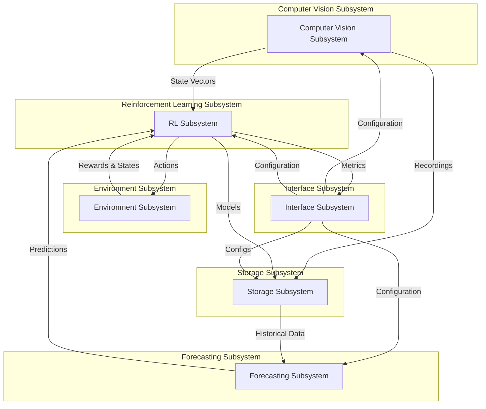

## Computer Vision Subsystem

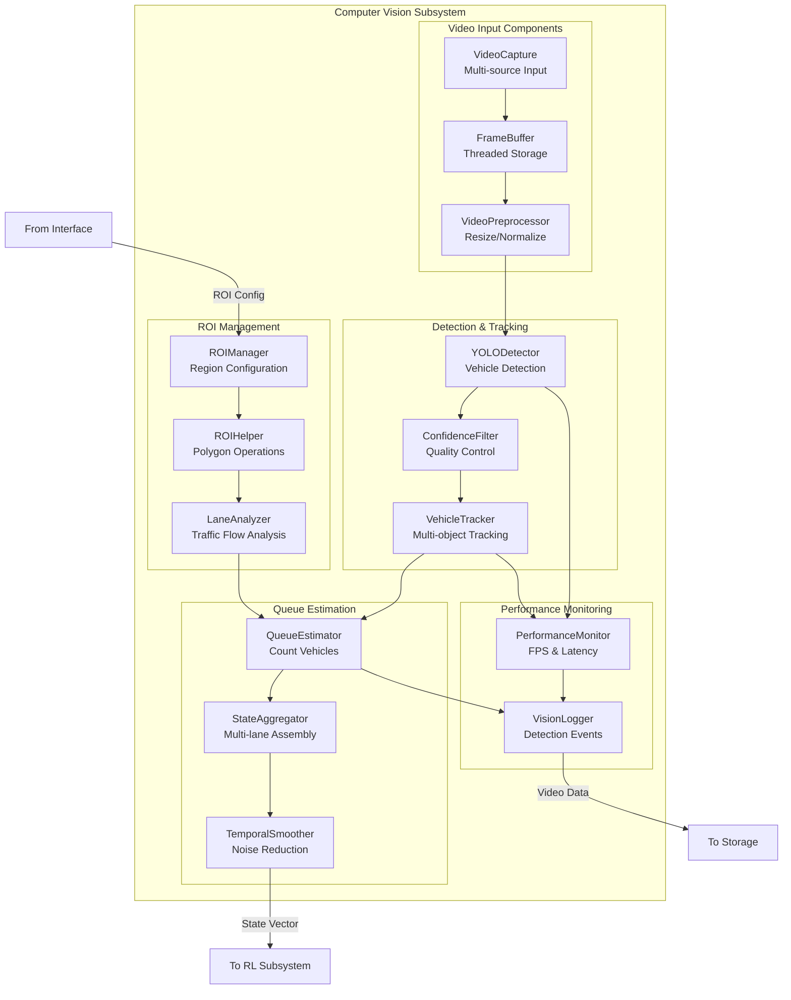

## Reinforcement Learning Subsystem

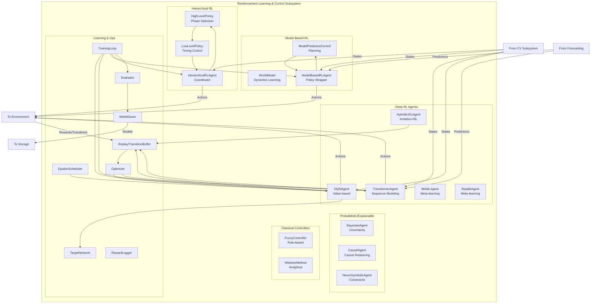

## Environment Subsystem

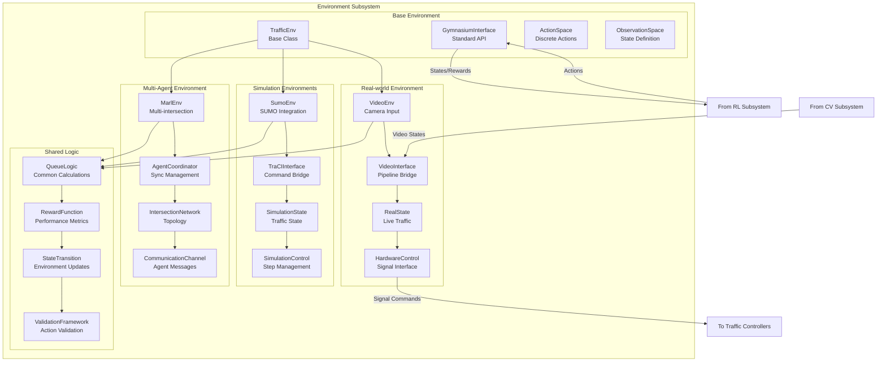

## Forecasting Subsystem

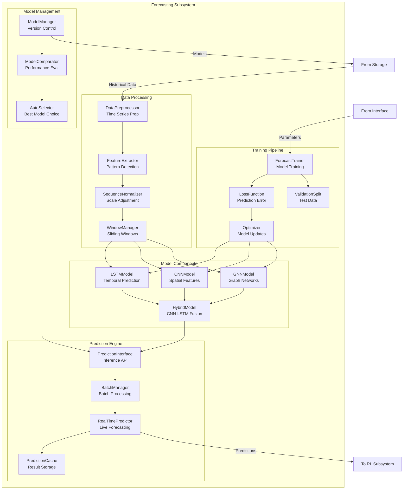

## Interface Subsystem

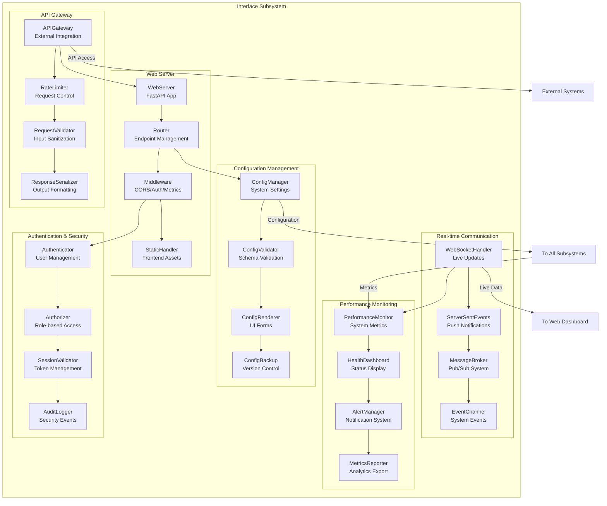

## Storage Subsystem

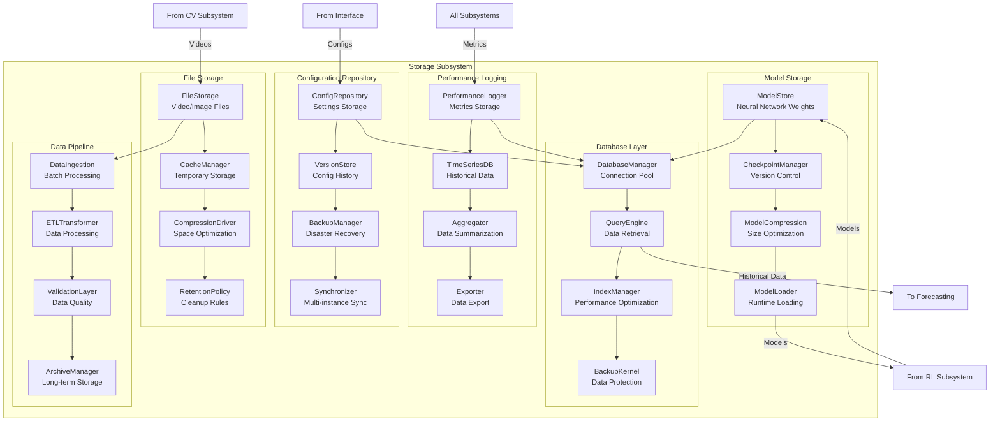

## Component Interaction Patterns

### Request-Response Pattern

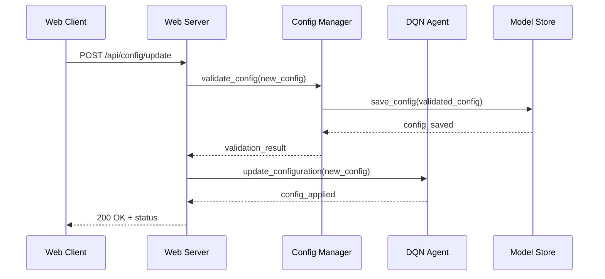

### Event-Driven Pattern

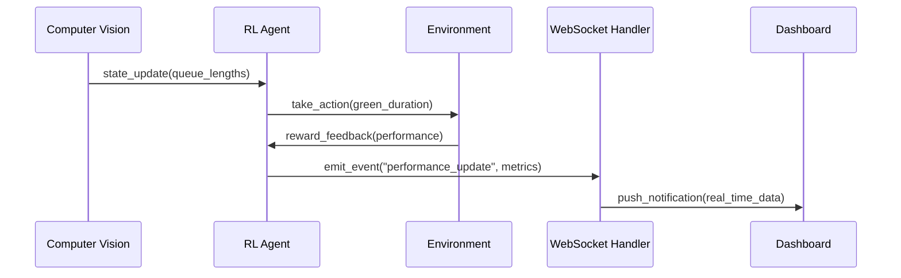

### Data Pipeline Pattern

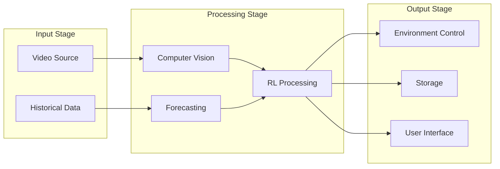

## Component Dependencies

### Dependency Graph

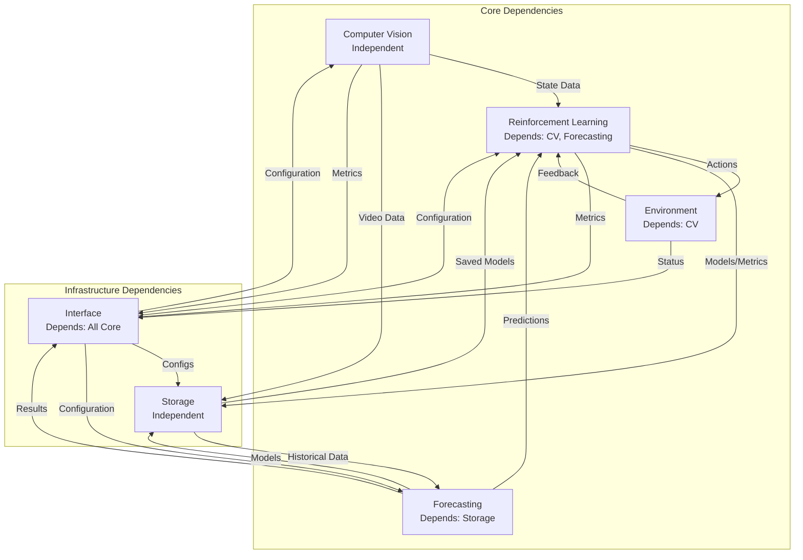

## Interface Specifications

### Computer Vision Interface

```yaml
ComputerVisionInterface:
  inputs:
    - video_stream: VideoStream
    - roi_config: ROIConfiguration
  outputs:
    - state_vector: float[4]
    - detection_metadata: DetectionResults
  methods:
    - process_frame(frame) -> StateVector
    - configure_roi(roi_config) -> bool
    - get_performance_metrics() -> Metrics
```

### Reinforcement Learning Interface

```yaml
ReinforcementLearningInterface:
  inputs:
    - state_vector: float[4]
    - forecast_data: ForecastResults
    - configuration: RLConfig
  outputs:
    - action: int
    - q_values: float[12]
    - training_metrics: TrainingResults
  methods:
    - select_action(state) -> int
    - train_step(batch) -> float
    - save_model(path) -> bool
    - load_model(path) -> bool
```

### Environment Interface

```yaml
EnvironmentInterface:
  inputs:
    - action: int
    - external_state: Any
  outputs:
    - observation: float[4]
    - reward: float
    - terminated: bool
    - info: Dict
  methods:
    - reset() -> Observation
    - step(action) -> (obs, reward, term, trunc, info)
    - render() -> Any
```

## Quality Attributes by Component

### Performance Characteristics

| **Component** | **Latency** | **Throughput** | **Memory** | **CPU** |
|---------------|-------------|----------------|------------|---------|
| VideoCapture | 33ms | 30 FPS | 100MB | 10% |
| YOLODetector | 50ms | 20 FPS | 2GB | 80% |
| DQNAgent | 5ms | 200 Hz | 50MB | 15% |
| WebServer | 10ms | 1000 req/s | 200MB | 5% |
| ModelStore | 100ms | 10 ops/s | 1GB | 5% |

### Reliability Patterns

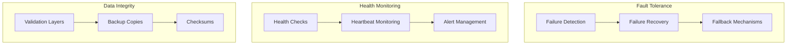

This comprehensive component diagram provides a detailed view of the system's internal structure, showing how each subsystem is organized and how components interact through well-defined interfaces. Each subsystem encapsulates related functionality while maintaining loose coupling with other subsystems through standardized interfaces.