# Data Flow Diagram - Adaptive Traffic Signal Control System

This document provides comprehensive Data Flow Diagrams (DFDs) for the Adaptive Traffic Signal Control System, illustrating how information moves through the system from input sources to output destinations across different operational modes.

## Overview

The system processes multiple data streams including video feeds, simulation data, historical traffic patterns, and configuration parameters to produce optimal traffic signal control decisions. Data flows through various processing stages with real-time constraints and quality assurance mechanisms.

## Context-Level Data Flow Diagram (Level 0)

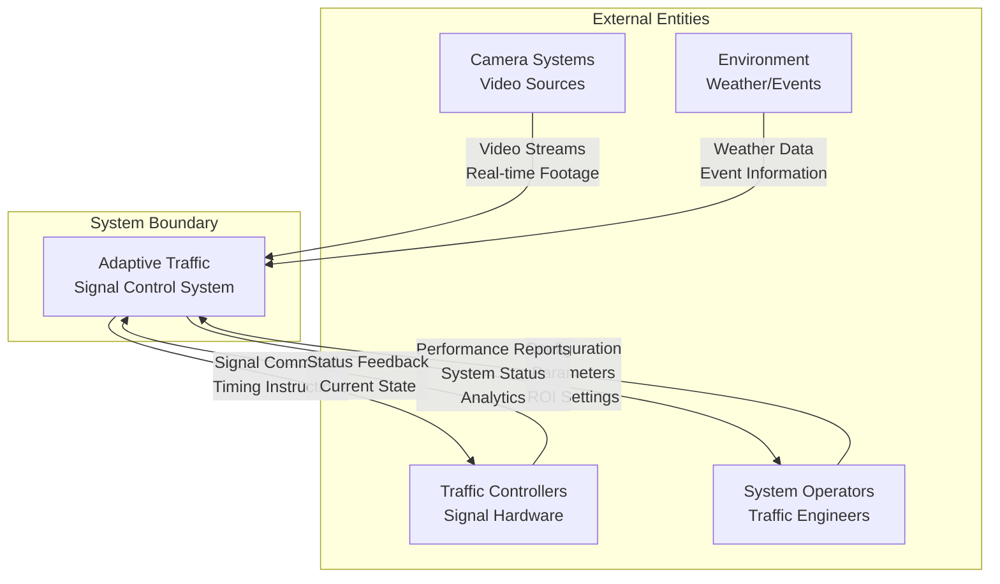

## Level 1 Data Flow Diagram - System Overview

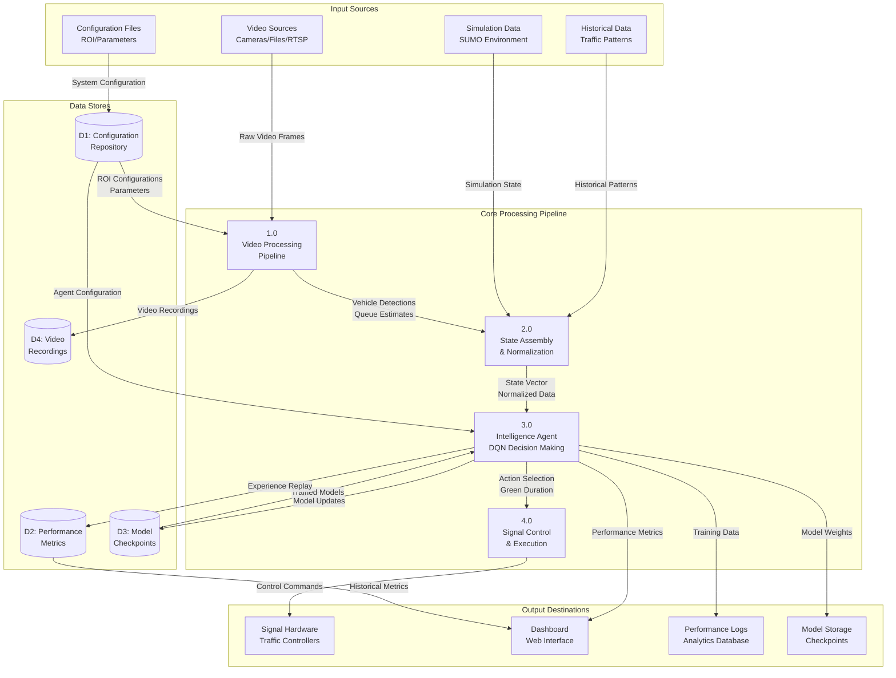

## Level 2 Data Flow Diagram - Video Processing Pipeline

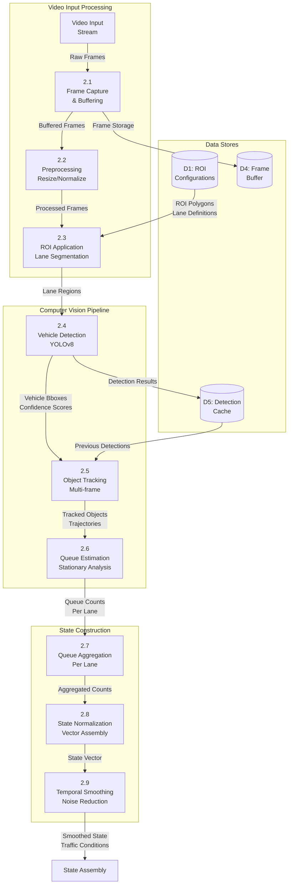

## Level 2 Data Flow Diagram - Intelligence Layer

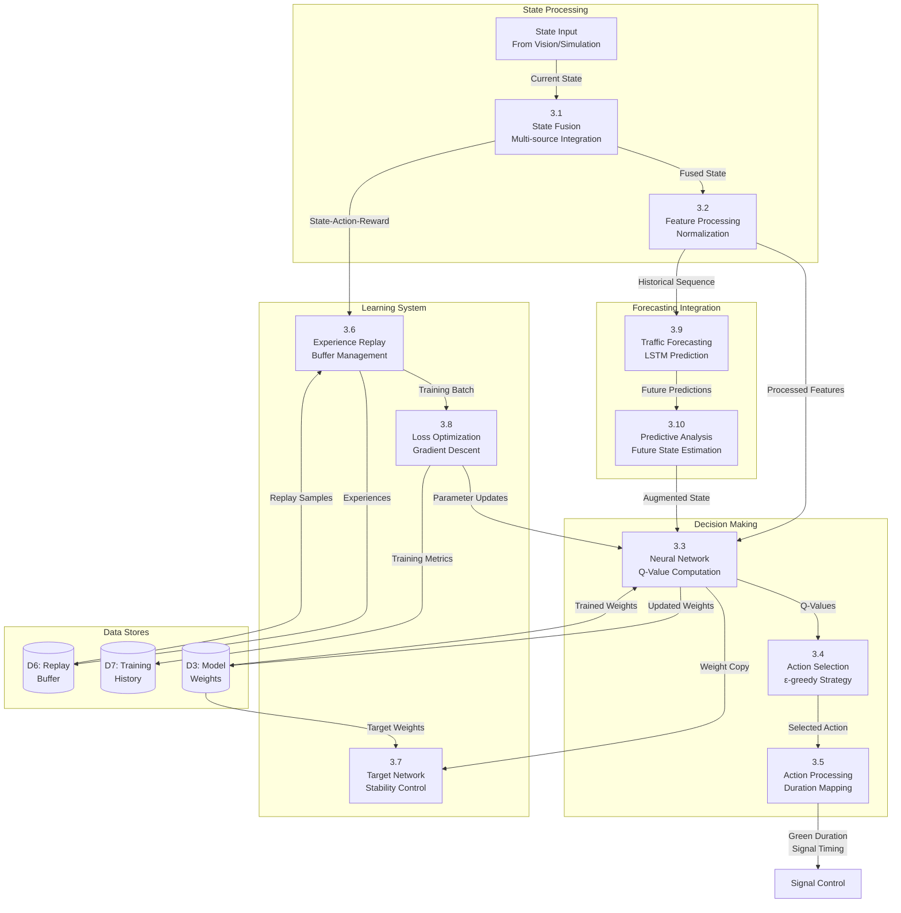

## Real-Time Processing Data Flow

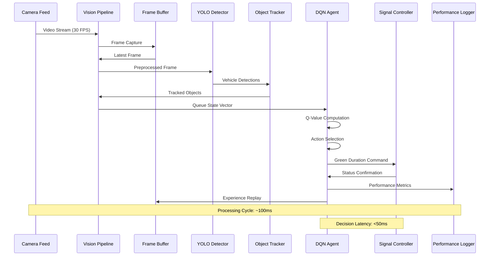

## Training Mode Data Flow

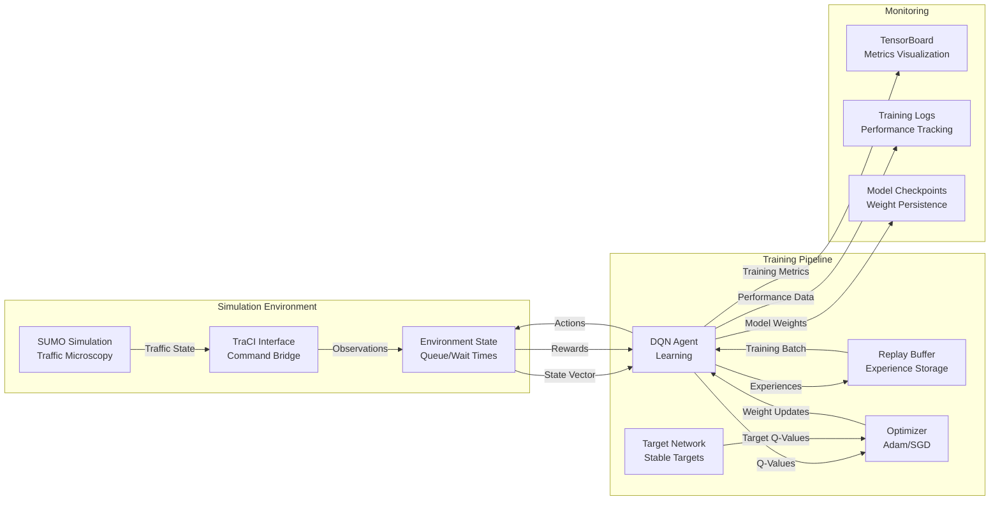

## Data Transformation Processes

### Video Frame Processing Pipeline

```mermaid
flowchart TD
    A[Raw Video Frame<br/>1920x1080 BGR] --> B[Frame Resize<br/>640x480]
    B --> C[ROI Extraction<br/>Lane Polygons]
    C --> D[YOLOv8 Detection<br/>Vehicle Bounding Boxes]
    D --> E[Confidence Filtering<br/>Threshold: 0.5]
    E --> F[Object Tracking<br/>Centroid Association]
    F --> G[Motion Analysis<br/>Velocity Estimation]
    G --> H[Queue Classification<br/>Stationary Vehicles]
    H --> I[Lane Aggregation<br/>Count per ROI]
    I --> J[State Vector<br/>[q1, q2, q3, q4]]
    
    style A fill:#f9f,stroke:#333,stroke-width:2px
    style J fill:#9f9,stroke:#333,stroke-width:2px
```

### State Vector Construction

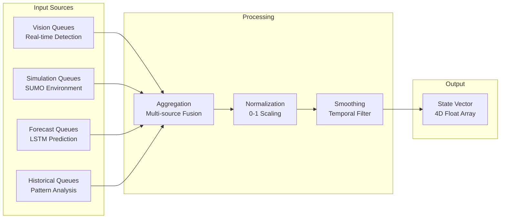

## Data Storage and Persistence

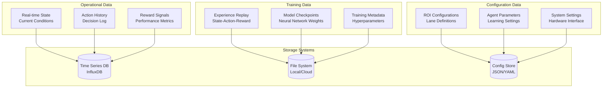

## Performance and Quality Metrics

### Data Quality Assurance

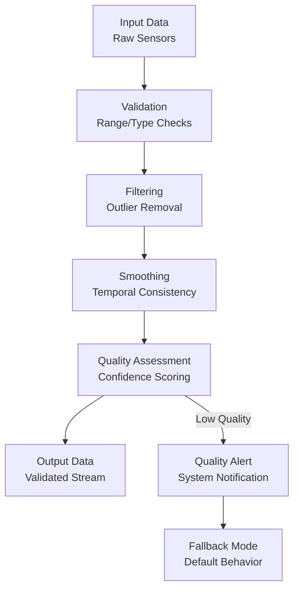

### Processing Pipeline Metrics

| **Stage** | **Input** | **Output** | **Latency** | **Throughput** |
|-----------|-----------|------------|-------------|----------------|
| Frame Capture | Video Stream | Raw Frames | 33ms (30 FPS) | 30 frames/sec |
| Preprocessing | Raw Frames | Processed Frames | 5ms | 200 frames/sec |
| YOLO Detection | Processed Frames | Bounding Boxes | 50ms | 20 frames/sec |
| Object Tracking | Detections | Tracks | 10ms | 100 tracks/sec |
| Queue Estimation | Tracks | Queue Counts | 2ms | 500 counts/sec |
| State Assembly | Queue Counts | State Vector | 1ms | 1000 vectors/sec |
| DQN Inference | State Vector | Action | 5ms | 200 actions/sec |
| Signal Control | Action | Commands | 10ms | 100 commands/sec |

## Error Handling and Data Recovery

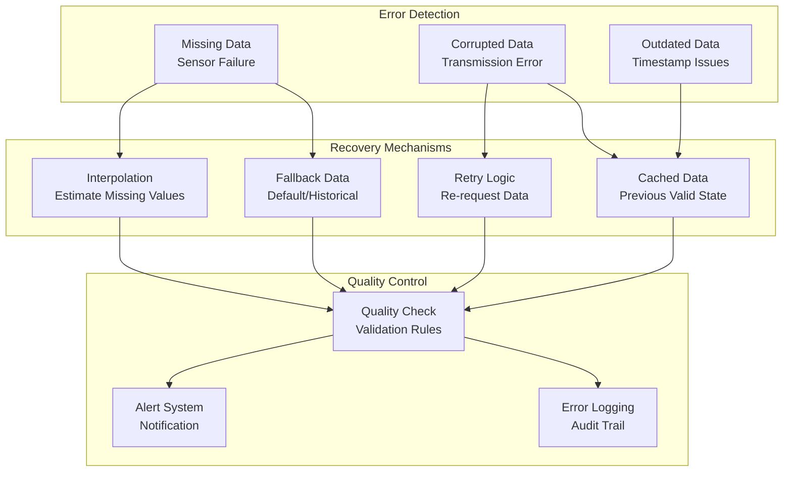

## Real-Time Constraints and Optimization

### Timing Requirements

```mermaid
gantt
    title Processing Timeline (100ms cycle)
    dateFormat X
    axisFormat %L
    
    section Video Pipeline
    Frame Capture     :a1, 0, 10
    Preprocessing     :a2, after a1, 15
    YOLO Detection    :a3, after a2, 50
    Object Tracking   :a4, after a3, 10
    
    section Decision Making
    State Assembly    :b1, after a4, 5
    DQN Inference     :b2, after b1, 15
    Action Selection  :b3, after b2, 3
    
    section Signal Control
    Command Generation :c1, after b3, 5
    Hardware Interface :c2, after c1, 7
```

### Optimization Strategies

1. **Parallel Processing**: Multi-threaded video processing pipeline
2. **Memory Management**: Efficient buffer allocation and reuse
3. **Model Optimization**: Quantized neural networks for faster inference
4. **Caching**: Frequently accessed configuration and model data
5. **Batch Processing**: Group operations for GPU acceleration

This comprehensive data flow documentation provides a complete picture of how information moves through the adaptive traffic control system, enabling efficient maintenance, debugging, and system optimization.