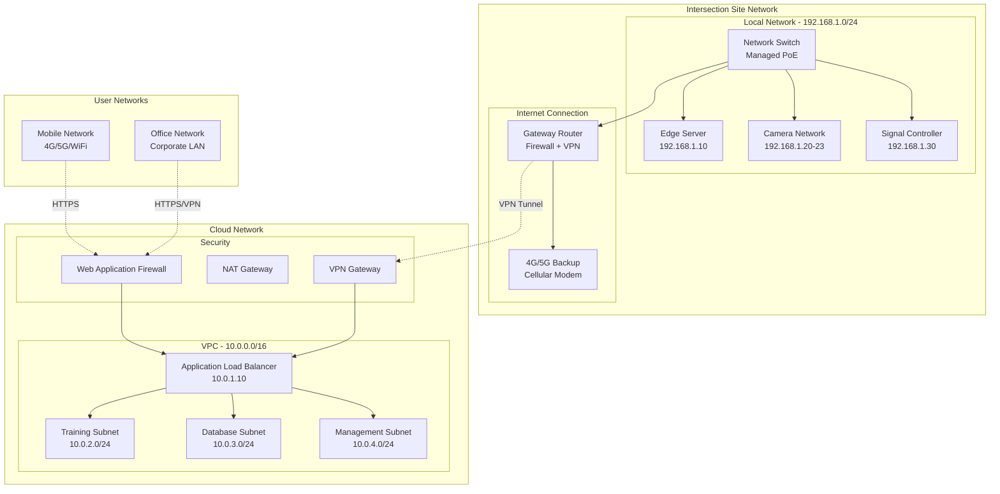
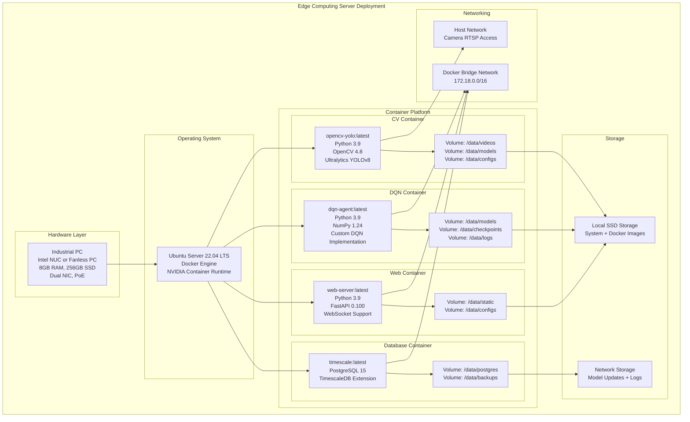
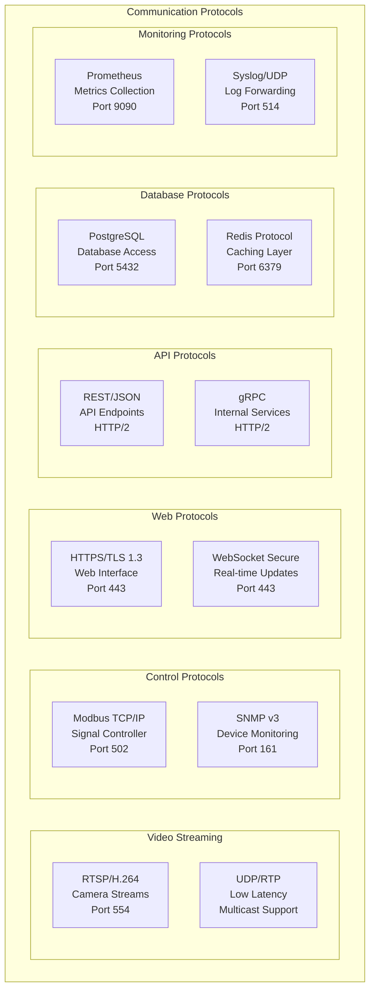
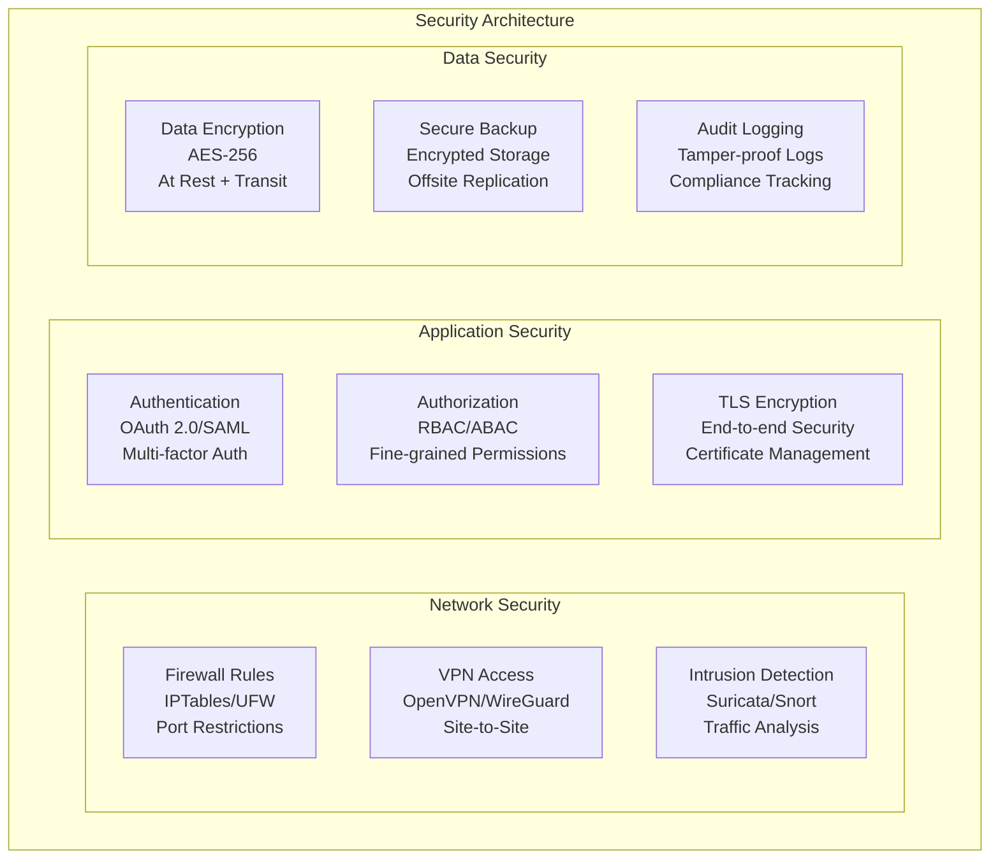

# Deployment Diagram - Adaptive Traffic Signal Control System

This document provides comprehensive Deployment Diagrams for the Adaptive Traffic Signal Control System, showing the physical distribution of system components across different environments including intersection sites, cloud infrastructure, and user devices.

## System Deployment Overview

```mermaid
graph TB
    subgraph "Intersection Site A"
        subgraph "Edge Computing Server"
            direction TB
            ECS[Edge Computing Server<br/>Intel NUC / Industrial PC]
            CVP[Computer Vision Process<br/>Python + OpenCV + YOLO]
            DQN[DQN Agent Process<br/>NumPy + Inference Engine]
            WEB[Local Web Server<br/>FastAPI + WebSocket]
            LDB[Local Database<br/>SQLite + Time Series]
        end
        
        subgraph "Camera Array"
            CAM1[Camera 1<br/>IP Camera - North]
            CAM2[Camera 2<br/>IP Camera - South]
            CAM3[Camera 3<br/>IP Camera - East]
            CAM4[Camera 4<br/>IP Camera - West]
        end
        
        subgraph "Signal Hardware"
            TSC[Traffic Signal Controller<br/>Industrial Controller]
            TL1[Traffic Light - NS]
            TL2[Traffic Light - EW]
            PED[Pedestrian Signals]
        end
    end
    
    subgraph "Cloud Infrastructure"
        subgraph "Training Server"
            TS[Training Server<br/>GPU-enabled VM]
            TP[Training Process<br/>PyTorch + SUMO]
            SS[SUMO Simulator<br/>Traffic Simulation]
            ML[Model Lifecycle<br/>MLflow + Versioning]
        end
        
        subgraph "Database Server"
            DB[Database Server<br/>PostgreSQL Cluster]
            PDB[Performance Database<br/>Time Series Data]
            FS[File Storage<br/>S3/Azure Blob]
            MS[Model Storage<br/>Trained Weights]
        end
        
        subgraph "Management Services"
            API[API Gateway<br/>Load Balancer]
            MON[Monitoring<br/>Prometheus + Grafana]
            LOG[Logging<br/>ELK Stack]
        end
    end
    
    subgraph "User Access Layer"
        subgraph "Engineer Devices"
            LAP[Engineer Laptop<br/>Management Interface]
            MOB[Mobile Device<br/>Monitoring App]
        end
        
        subgraph "Control Center"
            CC[Control Center<br/>Traffic Management]
            DASH[Dashboard Server<br/>React + D3.js]
        end
    end
    
    %% Network Connections
    CAM1 -.->|RTSP Stream| CVP
    CAM2 -.->|RTSP Stream| CVP
    CAM3 -.->|RTSP Stream| CVP
    CAM4 -.->|RTSP Stream| CVP
    
    CVP -->|State Data| DQN
    DQN -->|Control Commands| TSC
    TSC -->|Hardware Control| TL1
    TSC -->|Hardware Control| TL2
    TSC -->|Hardware Control| PED
    
    ECS -.->|HTTPS/WSS| API
    TP -.->|Model Upload| MS
    MS -.->|Model Download| DQN
    
    LAP -.->|HTTPS| API
    MOB -.->|HTTPS| API
    CC -.->|HTTPS| DASH
    
    ECS -->|Metrics/Logs| MON
    ECS -->|Performance Data| PDB
```



## Physical Network Architecture



## Detailed Edge Computing Deployment



## Cloud Infrastructure Deployment

```mermaid
graph TB
    subgraph "AWS/Azure Cloud Deployment"
        subgraph "Compute Services"
            direction TB
            subgraph "Training Cluster"
                GPU1[GPU Instance 1<br/>p3.2xlarge (V100)<br/>Training Process<br/>SUMO Simulator]
                GPU2[GPU Instance 2<br/>p3.2xlarge (V100)<br/>Model Validation<br/>Hyperparameter Tuning]
                CPU[CPU Instance<br/>c5.4xlarge<br/>SUMO Simulation<br/>Data Processing]
            end
            
            subgraph "API Services"
                API1[API Server 1<br/>t3.large<br/>FastAPI Application<br/>Auto Scaling Group]
                API2[API Server 2<br/>t3.large<br/>FastAPI Application<br/>Auto Scaling Group]
                LB[Load Balancer<br/>Application Load Balancer<br/>SSL Termination]
            end
        end
        
        subgraph "Storage Services"
            subgraph "Database Cluster"
                DB_PRIMARY[Primary DB<br/>RDS PostgreSQL<br/>db.r5.xlarge<br/>Multi-AZ]
                DB_READ[Read Replica<br/>RDS PostgreSQL<br/>db.r5.large<br/>Cross-Region]
            end
            
            subgraph "Object Storage"
                S3_MODELS[Model Storage<br/>S3 Bucket<br/>Versioned Models<br/>Lifecycle Policies]
                S3_DATA[Data Storage<br/>S3 Bucket<br/>Training Data<br/>Video Archives]
                S3_BACKUP[Backup Storage<br/>S3 Glacier<br/>Long-term Archive]
            end
        end
        
        subgraph "Monitoring & Logging"
            CW[CloudWatch<br/>Metrics & Alarms<br/>Log Aggregation]
            PROM[Prometheus<br/>Custom Metrics<br/>Service Discovery]
            GRAF[Grafana<br/>Visualization<br/>Dashboards]
        end
        
        subgraph "Security & Networking"
            VPC[VPC<br/>10.0.0.0/16<br/>Multi-AZ Subnets]
            SG[Security Groups<br/>Firewall Rules<br/>Network ACLs]
            IAM[IAM Roles<br/>Service Permissions<br/>Access Control]
        end
    end
    
    %% Service connections
    LB --> API1
    LB --> API2
    API1 --> DB_PRIMARY
    API2 --> DB_READ
    
    GPU1 --> S3_MODELS
    GPU2 --> S3_MODELS
    CPU --> S3_DATA
    
    API1 --> CW
    GPU1 --> PROM
    PROM --> GRAF
    
    ALL[All Services] --> VPC
    ALL --> SG
    ALL --> IAM
```

## Container Orchestration with Docker Compose

```yaml
# docker-compose.yml for Edge Deployment
version: '3.8'

services:
  computer-vision:
    image: adaptive-traffic/cv:latest
    container_name: traffic-cv
    restart: unless-stopped
    network_mode: host
    volumes:
      - ./data/models:/data/models:ro
      - ./data/configs:/data/configs:ro
      - ./data/videos:/data/videos
    environment:
      - YOLO_MODEL_PATH=/data/models/yolov8n.pt
      - ROI_CONFIG_PATH=/data/configs/roi_config.json
      - RTSP_STREAMS=rtsp://192.168.1.20:554/stream1,rtsp://192.168.1.21:554/stream1
    devices:
      - /dev/video0:/dev/video0
    deploy:
      resources:
        limits:
          memory: 2G
        reservations:
          memory: 1G

  dqn-agent:
    image: adaptive-traffic/dqn:latest
    container_name: traffic-dqn
    restart: unless-stopped
    networks:
      - traffic-net
    volumes:
      - ./data/models:/data/models
      - ./data/checkpoints:/data/checkpoints
      - ./data/logs:/data/logs
    environment:
      - MODEL_PATH=/data/models/dqn_traffic.npz
      - LOG_LEVEL=INFO
      - PERFORMANCE_LOG_PATH=/data/logs/performance.log
    depends_on:
      - computer-vision
      - timeseries-db
    deploy:
      resources:
        limits:
          memory: 1G
        reservations:
          memory: 512M

  web-server:
    image: adaptive-traffic/web:latest
    container_name: traffic-web
    restart: unless-stopped
    ports:
      - "8080:8080"
      - "8443:8443"
    networks:
      - traffic-net
    volumes:
      - ./data/configs:/data/configs
      - ./data/static:/data/static
      - ./ssl:/ssl:ro
    environment:
      - FASTAPI_HOST=0.0.0.0
      - FASTAPI_PORT=8080
      - SSL_CERT_PATH=/ssl/cert.pem
      - SSL_KEY_PATH=/ssl/key.pem
    depends_on:
      - dqn-agent
      - timeseries-db

  timeseries-db:
    image: timescale/timescaledb:latest-pg15
    container_name: traffic-db
    restart: unless-stopped
    networks:
      - traffic-net
    volumes:
      - timescale-data:/var/lib/postgresql/data
      - ./backups:/backups
    environment:
      - POSTGRES_DB=traffic_metrics
      - POSTGRES_USER=traffic_user
      - POSTGRES_PASSWORD=${DB_PASSWORD}
      - TIMESCALEDB_TELEMETRY=off
    ports:
      - "5432:5432"
    deploy:
      resources:
        limits:
          memory: 1G
        reservations:
          memory: 512M

networks:
  traffic-net:
    driver: bridge
    ipam:
      config:
        - subnet: 172.18.0.0/16

volumes:
  timescale-data:
    driver: local
```

## Kubernetes Deployment (Cloud)

```yaml
# kubernetes-deployment.yaml
apiVersion: apps/v1
kind: Deployment
metadata:
  name: training-deployment
  namespace: adaptive-traffic
spec:
  replicas: 2
  selector:
    matchLabels:
      app: training-server
  template:
    metadata:
      labels:
        app: training-server
    spec:
      nodeSelector:
        node-type: gpu
      containers:
      - name: training-container
        image: adaptive-traffic/training:latest
        resources:
          limits:
            nvidia.com/gpu: 1
            memory: "16Gi"
            cpu: "4"
          requests:
            memory: "8Gi"
            cpu: "2"
        env:
        - name: CUDA_VISIBLE_DEVICES
          value: "0"
        - name: SUMO_HOME
          value: "/opt/sumo"
        volumeMounts:
        - name: model-storage
          mountPath: /data/models
        - name: training-data
          mountPath: /data/training
      volumes:
      - name: model-storage
        persistentVolumeClaim:
          claimName: model-storage-pvc
      - name: training-data
        persistentVolumeClaim:
          claimName: training-data-pvc

---
apiVersion: v1
kind: Service
metadata:
  name: training-service
  namespace: adaptive-traffic
spec:
  selector:
    app: training-server
  ports:
  - port: 8000
    targetPort: 8000
    protocol: TCP
  type: ClusterIP
```

## Hardware Requirements by Deployment Type

### Edge Computing Server Specifications

| **Component** | **Minimum** | **Recommended** | **High Performance** |
|---------------|-------------|-----------------|---------------------|
| **CPU** | Intel i5-8th gen | Intel i7-10th gen | Intel i9-12th gen |
| **RAM** | 8GB DDR4 | 16GB DDR4 | 32GB DDR4 |
| **Storage** | 256GB SSD | 512GB NVMe SSD | 1TB NVMe SSD |
| **GPU** | Integrated | NVIDIA GTX 1660 | NVIDIA RTX 3070 |
| **Network** | Dual 1Gb Ethernet | Dual 1Gb + WiFi 6 | Dual 10Gb Ethernet |
| **Power** | 65W TDP | 95W TDP | 125W TDP |
| **Enclosure** | Fanless Mini PC | Industrial PC | Rack-mount Server |

### Cloud Server Specifications

| **Deployment** | **Instance Type** | **vCPU** | **RAM** | **Storage** | **Network** |
|----------------|-------------------|----------|---------|-------------|-------------|
| **Training** | p3.2xlarge | 8 | 61GB | 1TB NVMe | 10 Gbps |
| **API Server** | t3.large | 2 | 8GB | 100GB GP3 | 5 Gbps |
| **Database** | db.r5.xlarge | 4 | 32GB | 500GB GP3 | 10 Gbps |
| **Monitoring** | t3.medium | 2 | 4GB | 50GB GP3 | 1 Gbps |

## Network Communication Protocols



## Security and Access Control



## Deployment Automation Scripts

### Edge Device Provisioning

```bash
#!/bin/bash
# deploy-edge.sh - Edge device deployment script

set -e

# Configuration
EDGE_IP="192.168.1.10"
DOCKER_COMPOSE_VERSION="2.20.0"
SYSTEM_USER="traffic"

echo "Starting edge device deployment..."

# Update system packages
sudo apt update && sudo apt upgrade -y

# Install Docker and Docker Compose
curl -fsSL https://get.docker.com | sudo sh
sudo usermod -aG docker $SYSTEM_USER

# Install Docker Compose
sudo curl -L "https://github.com/docker/compose/releases/download/v${DOCKER_COMPOSE_VERSION}/docker-compose-$(uname -s)-$(uname -m)" -o /usr/local/bin/docker-compose
sudo chmod +x /usr/local/bin/docker-compose

# Create directory structure
sudo mkdir -p /opt/adaptive-traffic/{data/{models,configs,videos,logs,checkpoints},ssl,backups}
sudo chown -R $SYSTEM_USER:$SYSTEM_USER /opt/adaptive-traffic

# Download and deploy application
cd /opt/adaptive-traffic
git clone https://github.com/your-org/adaptive-traffic.git .
cp deployment/edge/docker-compose.yml .
cp deployment/edge/.env.example .env

# Generate SSL certificates
openssl req -x509 -newkey rsa:4096 -keyout ssl/key.pem -out ssl/cert.pem -days 365 -nodes -subj "/CN=${EDGE_IP}"

# Start services
docker-compose up -d

# Install system service for auto-start
sudo cp deployment/edge/adaptive-traffic.service /etc/systemd/system/
sudo systemctl enable adaptive-traffic
sudo systemctl start adaptive-traffic

echo "Edge deployment completed successfully!"
```

### Cloud Infrastructure Terraform

```hcl
# main.tf - Terraform configuration for cloud infrastructure
provider "aws" {
  region = var.aws_region
}

# VPC and Networking
resource "aws_vpc" "adaptive_traffic" {
  cidr_block           = "10.0.0.0/16"
  enable_dns_hostnames = true
  enable_dns_support   = true

  tags = {
    Name = "adaptive-traffic-vpc"
  }
}

resource "aws_subnet" "training" {
  vpc_id            = aws_vpc.adaptive_traffic.id
  cidr_block        = "10.0.2.0/24"
  availability_zone = "${var.aws_region}a"

  tags = {
    Name = "training-subnet"
  }
}

# Training Server with GPU
resource "aws_instance" "training_server" {
  ami           = "ami-0c02fb55956c7d316" # Deep Learning AMI
  instance_type = "p3.2xlarge"
  subnet_id     = aws_subnet.training.id
  
  vpc_security_group_ids = [aws_security_group.training.id]
  
  user_data = file("${path.module}/scripts/setup-training.sh")
  
  tags = {
    Name = "adaptive-traffic-training"
  }
}

# Database
resource "aws_db_instance" "metrics_db" {
  identifier     = "adaptive-traffic-db"
  engine         = "postgres"
  engine_version = "15.3"
  instance_class = "db.r5.xlarge"
  
  allocated_storage     = 500
  max_allocated_storage = 1000
  storage_type          = "gp3"
  storage_encrypted     = true
  
  db_name  = "traffic_metrics"
  username = "traffic_admin"
  password = random_password.db_password.result
  
  vpc_security_group_ids = [aws_security_group.database.id]
  db_subnet_group_name   = aws_db_subnet_group.main.name
  
  backup_retention_period = 7
  backup_window          = "03:00-04:00"
  maintenance_window     = "sun:04:00-sun:05:00"
  
  tags = {
    Name = "adaptive-traffic-database"
  }
}

# S3 Buckets for Model Storage
resource "aws_s3_bucket" "models" {
  bucket = "adaptive-traffic-models-${random_id.bucket_suffix.hex}"
  
  tags = {
    Name = "adaptive-traffic-models"
  }
}

resource "aws_s3_bucket_versioning" "models" {
  bucket = aws_s3_bucket.models.id
  versioning_configuration {
    status = "Enabled"
  }
}
```

This comprehensive deployment diagram provides a complete blueprint for deploying the Adaptive Traffic Signal Control System across edge computing sites, cloud infrastructure, and user access points, with detailed specifications for hardware, networking, security, and automation.