# 🏗️ System Architecture Documentation

This document provides a comprehensive overview of the Adaptive Traffic Signal Control System architecture, including detailed diagrams, component interactions, and data flow patterns.

## 📋 **Table of Contents**

- [High-Level System Architecture](#high-level-system-architecture)
- [Layered Architecture](#layered-architecture)
- [Component Interaction Diagrams](#component-interaction-diagrams)
- [Data Flow Architecture](#data-flow-architecture)
- [Deployment Architecture](#deployment-architecture)
- [Multi-Agent Architecture](#multi-agent-architecture)

---

## 🎯 **High-Level System Architecture**

The Adaptive Traffic Signal Control System follows a **modular, layered architecture** that separates concerns across perception, decision-making, control, and monitoring layers.

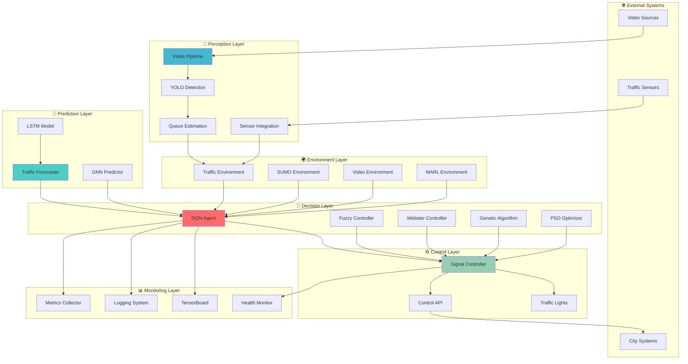

---

## 🏛️ **Layered Architecture**

### **Layer 1: Perception Layer** 🎯
**Purpose**: Convert raw sensor data into structured traffic information

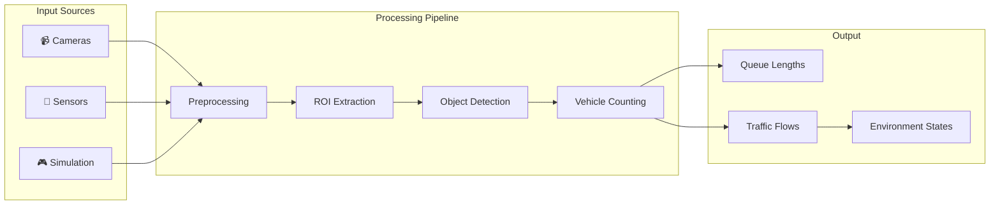

### **Layer 2: Environment Layer** 🌍
**Purpose**: Provide standardized interfaces for different traffic scenarios

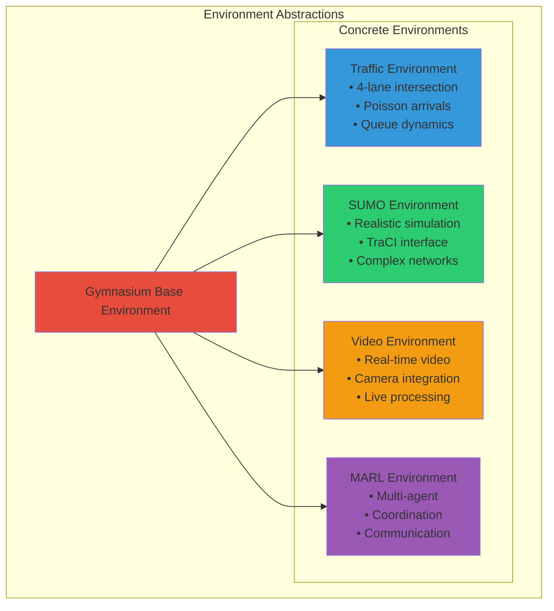

### **Layer 3: Decision Layer** 🧠
**Purpose**: Intelligent decision making for optimal traffic control

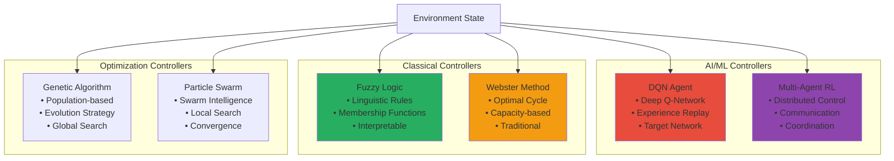

### **Layer 4: Control Layer** ⚙️
**Purpose**: Execute control decisions and interface with physical systems

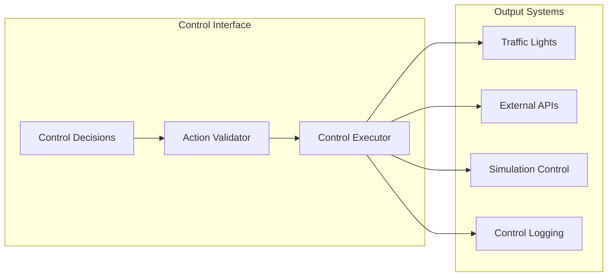

---

## 🔄 **Component Interaction Diagrams**

### **Training Pipeline Interaction**

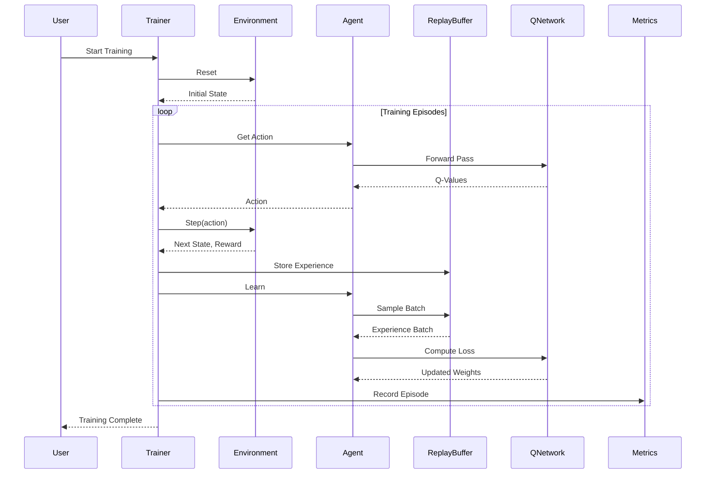

### **Real-Time Inference Flow**

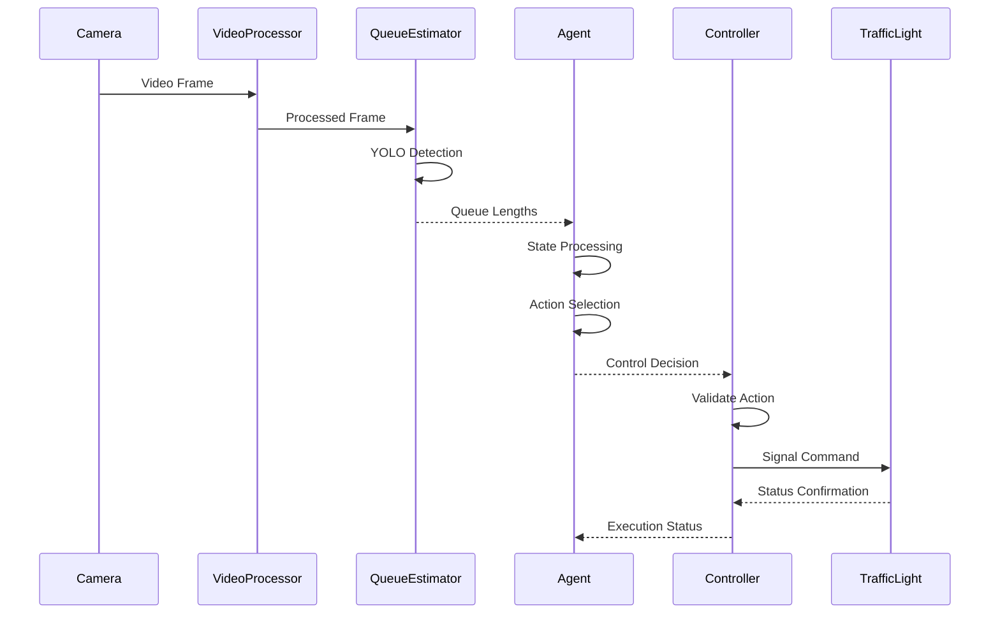

---

## 📊 **Data Flow Architecture**

### **Multi-Modal Data Integration**

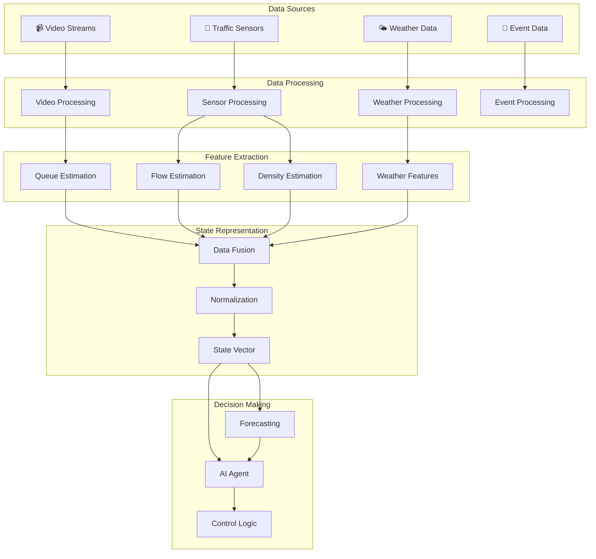

### **Information Flow in Multi-Agent System**

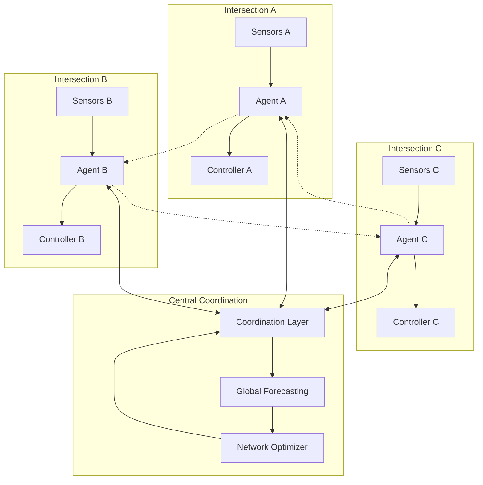

---

## 🚀 **Deployment Architecture**

### **Edge Deployment**

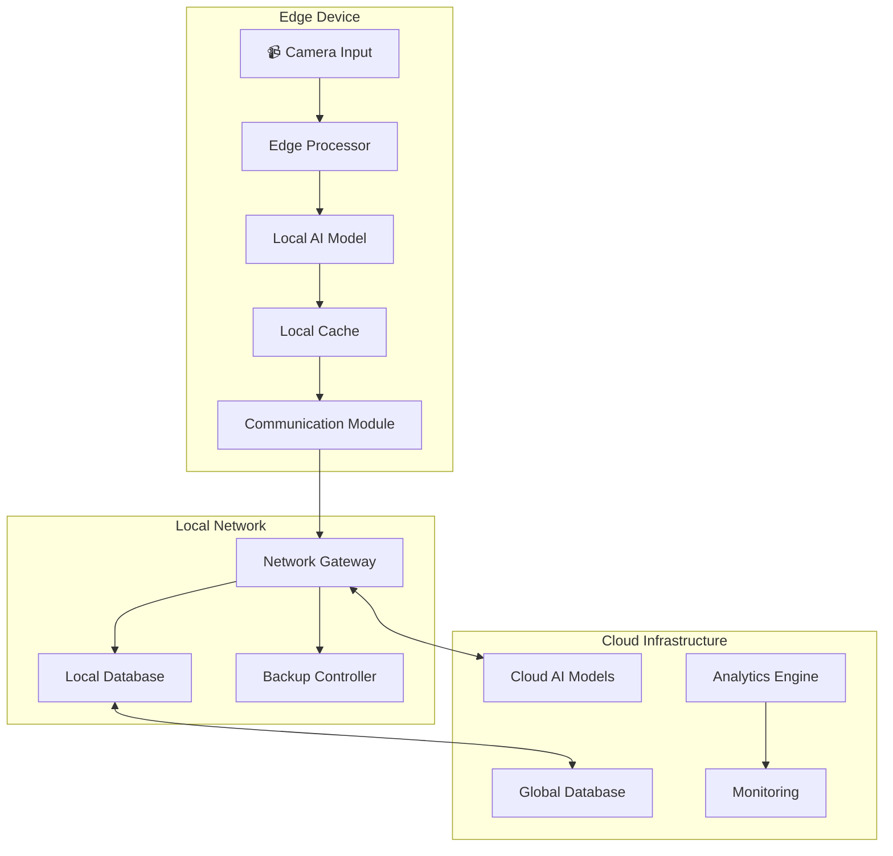

### **Cloud-Native Architecture**

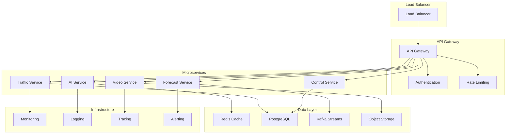

---

## 🤝 **Multi-Agent Architecture**

### **Distributed Agent Coordination**

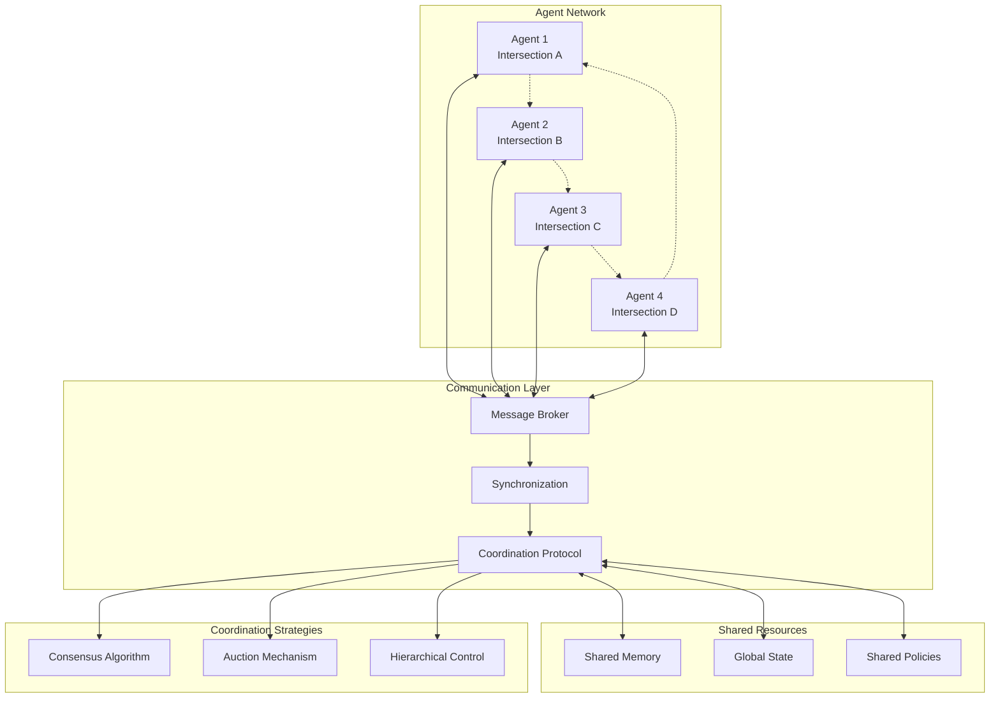

### **Hierarchical Multi-Agent Structure**

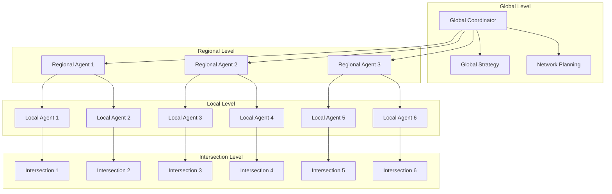

---

## 🔧 **Technology Stack Architecture**

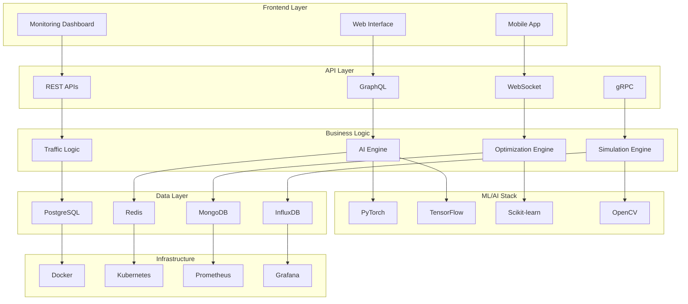

---

## 📈 **Performance Architecture**

### **Scalability Patterns**

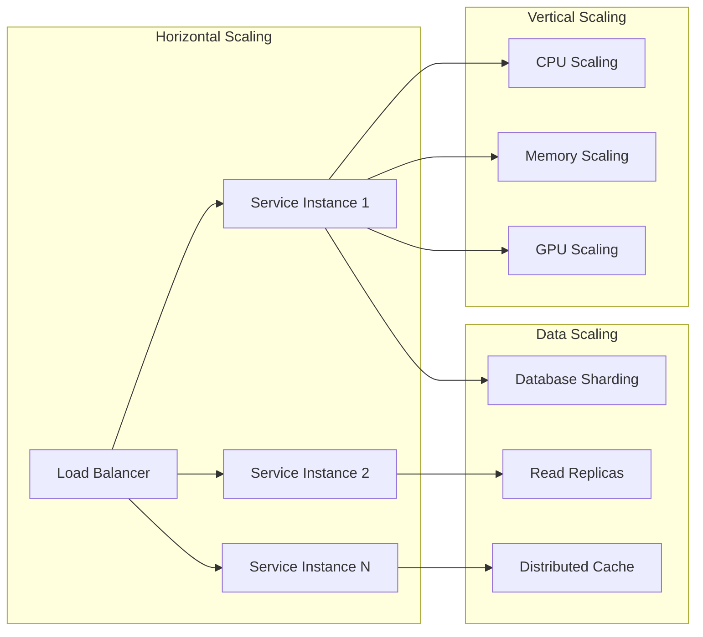

---

## 🔒 **Security Architecture**

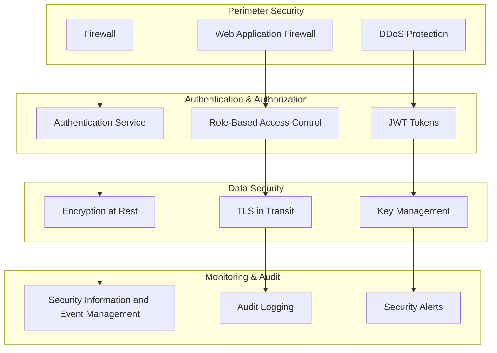

---

## 📚 **Related Documentation**

- **[API Reference](../api/README.md)**: Detailed API documentation
- **[User Manual](../user-guide/README.md)**: User guidance and tutorials
- **[Developer Guide](../developer-guide/README.md)**: Development setup and practices
- **[Deployment Guide](../deployment/README.md)**: Production deployment instructions

---

## 🎯 **Design Principles**

### **1. Modularity**
- Clear separation of concerns
- Pluggable components
- Standard interfaces

### **2. Scalability**
- Horizontal and vertical scaling
- Distributed architecture
- Load balancing

### **3. Reliability**
- Fault tolerance
- Graceful degradation
- Circuit breakers

### **4. Performance**
- Optimized algorithms
- Efficient data structures
- Resource management

### **5. Security**
- Defense in depth
- Principle of least privilege
- Secure by design

This architecture provides a robust, scalable, and maintainable foundation for intelligent traffic signal control systems.