# Entity-Relationship Diagram - Adaptive Traffic Signal Control System

This document provides a comprehensive Entity-Relationship Diagram (ERD) for the Adaptive Traffic Signal Control System, defining the complete data model structure that supports training, inference, monitoring, and analytics operations.

## Database Schema Overview

The data model is designed to support multiple operational modes: training simulations, real-time inference, performance monitoring, and historical analysis. The schema captures all aspects of traffic control operations from physical infrastructure to AI model performance.

## Complete Entity-Relationship Diagram

```mermaid
erDiagram
    INTERSECTION {
        int intersection_id PK
        string name
        float latitude
        float longitude
        string address
        int num_lanes
        string intersection_type
        datetime created_at
        datetime updated_at
        boolean active
        string timezone
        json metadata
    }
    
    LANE {
        int lane_id PK
        int intersection_id FK
        int lane_number
        string direction
        string lane_type
        float length
        int capacity
        json roi_coordinates
        boolean active
        datetime created_at
    }
    
    PHASE {
        int phase_id PK
        int intersection_id FK
        int phase_number
        string phase_name
        json lane_assignments
        int min_green_duration
        int max_green_duration
        int yellow_duration
        int all_red_duration
        boolean active
    }
    
    CONFIGURATION {
        int config_id PK
        int intersection_id FK
        string config_name
        string config_type
        json parameters
        string version
        datetime created_at
        datetime activated_at
        boolean is_active
        string created_by
    }
    
    VEHICLE_DETECTION {
        int detection_id PK
        int lane_id FK
        datetime timestamp
        float confidence_score
        string vehicle_type
        json bounding_box
        int frame_number
        string camera_id
        float x_coordinate
        float y_coordinate
        float width
        float height
    }
    
    QUEUE_MEASUREMENT {
        int measurement_id PK
        int lane_id FK
        datetime timestamp
        int queue_length
        float average_wait_time
        int vehicle_count
        float occupancy_rate
        string measurement_method
        float confidence
        json raw_data
    }
    
    MODEL {
        int model_id PK
        string model_name
        string model_type
        string algorithm
        string version
        json architecture
        json hyperparameters
        datetime created_at
        string created_by
        string file_path
        long file_size
        string status
    }
    
    CHECKPOINT {
        int checkpoint_id PK
        int model_id FK
        int episode_number
        float model_loss
        float validation_score
        datetime timestamp
        string file_path
        long file_size
        json metrics
        boolean is_best
    }
    
    TRAINING_EPISODE {
        int episode_id PK
        int model_id FK
        int intersection_id FK
        int episode_number
        datetime start_time
        datetime end_time
        float total_reward
        int total_steps
        float average_queue_length
        float average_wait_time
        int vehicles_processed
        json episode_config
        string status
    }
    
    EPISODE_STEP {
        int step_id PK
        int episode_id FK
        int step_number
        datetime timestamp
        json state_vector
        int action_taken
        float reward_received
        json next_state_vector
        boolean is_terminal
        float q_values
        float epsilon_value
        int current_phase
    }
    
    DECISION_EVENT {
        int decision_id PK
        int intersection_id FK
        int model_id FK
        datetime timestamp
        json input_state
        int selected_action
        float decision_confidence
        int green_duration
        int current_phase
        string decision_mode
        float processing_time
        string agent_version
    }
    
    STATE_OBSERVATION {
        int observation_id PK
        int decision_id FK
        int lane_id FK
        datetime timestamp
        float queue_length
        float wait_time
        float normalized_value
        string observation_source
        float confidence
        json metadata
    }
    
    ACTION_SELECTION {
        int action_id PK
        int decision_id FK
        int action_index
        float q_value
        float action_probability
        boolean was_selected
        string selection_method
        float exploration_rate
        json action_metadata
    }
    
    REWARD_CALCULATION {
        int reward_id PK
        int decision_id FK
        int episode_id FK
        datetime timestamp
        float total_reward
        float queue_penalty
        float wait_penalty
        float efficiency_bonus
        float max_queue_penalty
        json reward_components
        string calculation_method
    }
    
    PERFORMANCE_METRIC {
        int metric_id PK
        int intersection_id FK
        string metric_name
        string metric_type
        float metric_value
        datetime timestamp
        string time_period
        json aggregation_data
        string unit
        string source_component
    }
    
    SIGNAL_STATUS {
        int status_id PK
        int intersection_id FK
        int phase_id FK
        datetime timestamp
        string signal_state
        int remaining_duration
        int total_duration
        string status_source
        boolean manual_override
        string controller_id
    }
    
    SYSTEM_EVENT {
        int event_id PK
        int intersection_id FK
        datetime timestamp
        string event_type
        string severity
        string component
        string message
        json event_data
        boolean resolved
        datetime resolved_at
    }
    
    VIDEO_FRAME {
        int frame_id PK
        int intersection_id FK
        datetime timestamp
        string camera_id
        int frame_number
        string file_path
        int width
        int height
        float fps
        long file_size
        string encoding
    }
    
    ROI_DEFINITION {
        int roi_id PK
        int lane_id FK
        string roi_name
        json polygon_coordinates
        string roi_type
        datetime created_at
        boolean active
        json metadata
    }
    
    TRAFFIC_FORECAST {
        int forecast_id PK
        int intersection_id FK
        int model_id FK
        datetime forecast_time
        datetime prediction_time
        json predicted_values
        float confidence_score
        int forecast_horizon
        string model_type
        json model_parameters
    }

    %% Relationships
    INTERSECTION ||--o{ LANE : "has"
    INTERSECTION ||--o{ PHASE : "contains"
    INTERSECTION ||--o{ CONFIGURATION : "configured_by"
    INTERSECTION ||--o{ DECISION_EVENT : "controls"
    INTERSECTION ||--o{ PERFORMANCE_METRIC : "monitored_by"
    INTERSECTION ||--o{ SIGNAL_STATUS : "operates"
    INTERSECTION ||--o{ SYSTEM_EVENT : "generates"
    INTERSECTION ||--o{ VIDEO_FRAME : "recorded_at"
    INTERSECTION ||--o{ TRAFFIC_FORECAST : "predicted_for"
    INTERSECTION ||--o{ TRAINING_EPISODE : "simulated_at"
    
    LANE ||--o{ VEHICLE_DETECTION : "detected_in"
    LANE ||--o{ QUEUE_MEASUREMENT : "measured_in"
    LANE ||--o{ STATE_OBSERVATION : "observed_in"
    LANE ||--o{ ROI_DEFINITION : "defined_by"
    
    PHASE ||--o{ SIGNAL_STATUS : "displays"
    
    MODEL ||--o{ CHECKPOINT : "saved_as"
    MODEL ||--o{ TRAINING_EPISODE : "trains_with"
    MODEL ||--o{ DECISION_EVENT : "makes"
    MODEL ||--o{ TRAFFIC_FORECAST : "generates"
    
    TRAINING_EPISODE ||--o{ EPISODE_STEP : "contains"
    TRAINING_EPISODE ||--o{ REWARD_CALCULATION : "calculates"
    
    DECISION_EVENT ||--o{ STATE_OBSERVATION : "observes"
    DECISION_EVENT ||--o{ ACTION_SELECTION : "evaluates"
    DECISION_EVENT ||--o{ REWARD_CALCULATION : "receives"
    
    EPISODE_STEP ||--o{ REWARD_CALCULATION : "earns"
```



## Entity Definitions and Attributes

### Infrastructure Entities

#### INTERSECTION
Represents physical traffic intersections in the system.

| **Attribute** | **Type** | **Description** |
|---------------|----------|-----------------|
| intersection_id | Primary Key | Unique intersection identifier |
| name | String | Human-readable intersection name |
| latitude/longitude | Float | GPS coordinates |
| address | String | Physical address |
| num_lanes | Integer | Total number of approach lanes |
| intersection_type | String | Type (4-way, T-junction, roundabout) |
| active | Boolean | Whether intersection is operational |
| timezone | String | Local timezone for time-based operations |
| metadata | JSON | Additional intersection properties |

#### LANE
Represents individual traffic lanes at intersections.

| **Attribute** | **Type** | **Description** |
|---------------|----------|-----------------|
| lane_id | Primary Key | Unique lane identifier |
| intersection_id | Foreign Key | Associated intersection |
| lane_number | Integer | Lane number (0-3 typically) |
| direction | String | Traffic direction (North, South, East, West) |
| lane_type | String | Lane type (through, left-turn, right-turn) |
| length | Float | Lane length in meters |
| capacity | Integer | Maximum vehicle capacity |
| roi_coordinates | JSON | Camera region of interest coordinates |

#### PHASE
Defines signal phases for intersection control.

| **Attribute** | **Type** | **Description** |
|---------------|----------|-----------------|
| phase_id | Primary Key | Unique phase identifier |
| intersection_id | Foreign Key | Associated intersection |
| phase_number | Integer | Phase sequence number (0, 1) |
| phase_name | String | Phase description (NS_Green, EW_Green) |
| lane_assignments | JSON | Which lanes get green signal |
| min_green_duration | Integer | Minimum green time in seconds |
| max_green_duration | Integer | Maximum green time in seconds |
| yellow_duration | Integer | Yellow light duration |
| all_red_duration | Integer | All-red clearance time |

### Observation Entities

#### VEHICLE_DETECTION
Individual vehicle detections from computer vision system.

| **Attribute** | **Type** | **Description** |
|---------------|----------|-----------------|
| detection_id | Primary Key | Unique detection identifier |
| lane_id | Foreign Key | Lane where vehicle was detected |
| timestamp | DateTime | Detection timestamp |
| confidence_score | Float | YOLO detection confidence (0-1) |
| vehicle_type | String | Vehicle classification |
| bounding_box | JSON | Detection bounding box coordinates |
| frame_number | Integer | Video frame number |
| camera_id | String | Source camera identifier |

#### QUEUE_MEASUREMENT
Aggregated queue length measurements per lane.

| **Attribute** | **Type** | **Description** |
|---------------|----------|-----------------|
| measurement_id | Primary Key | Unique measurement identifier |
| lane_id | Foreign Key | Associated lane |
| timestamp | DateTime | Measurement timestamp |
| queue_length | Integer | Number of vehicles in queue |
| average_wait_time | Float | Average waiting time in seconds |
| vehicle_count | Integer | Total vehicles detected |
| occupancy_rate | Float | Lane occupancy percentage |
| measurement_method | String | Detection method (YOLO, manual, simulation) |
| confidence | Float | Measurement confidence level |

### AI/ML Entities

#### MODEL
Neural network models and their metadata.

| **Attribute** | **Type** | **Description** |
|---------------|----------|-----------------|
| model_id | Primary Key | Unique model identifier |
| model_name | String | Human-readable model name |
| model_type | String | Type (DQN, LSTM, GNN, CNN) |
| algorithm | String | Specific algorithm implementation |
| version | String | Model version string |
| architecture | JSON | Network architecture definition |
| hyperparameters | JSON | Training hyperparameters |
| file_path | String | Path to model file |
| file_size | Long | Model file size in bytes |
| status | String | Model status (training, active, deprecated) |

#### TRAINING_EPISODE
Training episodes for reinforcement learning.

| **Attribute** | **Type** | **Description** |
|---------------|----------|-----------------|
| episode_id | Primary Key | Unique episode identifier |
| model_id | Foreign Key | Associated model |
| intersection_id | Foreign Key | Training intersection |
| episode_number | Integer | Sequential episode number |
| start_time/end_time | DateTime | Episode duration |
| total_reward | Float | Cumulative episode reward |
| total_steps | Integer | Number of steps in episode |
| average_queue_length | Float | Episode average queue length |
| vehicles_processed | Integer | Total vehicles served |
| episode_config | JSON | Episode configuration parameters |

#### EPISODE_STEP
Individual steps within training episodes.

| **Attribute** | **Type** | **Description** |
|---------------|----------|-----------------|
| step_id | Primary Key | Unique step identifier |
| episode_id | Foreign Key | Associated episode |
| step_number | Integer | Sequential step number |
| timestamp | DateTime | Step timestamp |
| state_vector | JSON | Input state vector |
| action_taken | Integer | Selected action index |
| reward_received | Float | Immediate reward |
| next_state_vector | JSON | Resulting state |
| is_terminal | Boolean | Whether step ends episode |
| q_values | Float | Computed Q-values |
| epsilon_value | Float | Exploration rate used |

### Decision-Making Entities

#### DECISION_EVENT
Real-time signal timing decisions.

| **Attribute** | **Type** | **Description** |
|---------------|----------|-----------------|
| decision_id | Primary Key | Unique decision identifier |
| intersection_id | Foreign Key | Associated intersection |
| model_id | Foreign Key | Model making decision |
| timestamp | DateTime | Decision timestamp |
| input_state | JSON | Input state vector |
| selected_action | Integer | Chosen action index |
| decision_confidence | Float | Decision confidence score |
| green_duration | Integer | Resulting green time in seconds |
| current_phase | Integer | Active signal phase |
| decision_mode | String | Mode (training, inference, manual) |
| processing_time | Float | Decision latency in milliseconds |

#### STATE_OBSERVATION
Detailed state observations for decisions.

| **Attribute** | **Type** | **Description** |
|---------------|----------|-----------------|
| observation_id | Primary Key | Unique observation identifier |
| decision_id | Foreign Key | Associated decision |
| lane_id | Foreign Key | Lane being observed |
| timestamp | DateTime | Observation timestamp |
| queue_length | Float | Raw queue length |
| wait_time | Float | Average wait time |
| normalized_value | Float | Normalized observation value |
| observation_source | String | Source (camera, simulation) |
| confidence | Float | Observation confidence |

#### ACTION_SELECTION
Q-value computations and action selection details.

| **Attribute** | **Type** | **Description** |
|---------------|----------|-----------------|
| action_id | Primary Key | Unique action identifier |
| decision_id | Foreign Key | Associated decision |
| action_index | Integer | Action option index |
| q_value | Float | Computed Q-value for action |
| action_probability | Float | Selection probability |
| was_selected | Boolean | Whether action was chosen |
| selection_method | String | Method (greedy, epsilon-greedy, random) |
| exploration_rate | Float | Epsilon value used |

### Performance Entities

#### PERFORMANCE_METRIC
System performance measurements and KPIs.

| **Attribute** | **Type** | **Description** |
|---------------|----------|-----------------|
| metric_id | Primary Key | Unique metric identifier |
| intersection_id | Foreign Key | Associated intersection |
| metric_name | String | Metric name (avg_wait_time, throughput) |
| metric_type | String | Type (latency, throughput, accuracy) |
| metric_value | Float | Measured value |
| timestamp | DateTime | Measurement timestamp |
| time_period | String | Aggregation period (minute, hour, day) |
| aggregation_data | JSON | Raw data used for aggregation |
| unit | String | Measurement unit |
| source_component | String | Component generating metric |

#### REWARD_CALCULATION
Detailed reward function calculations.

| **Attribute** | **Type** | **Description** |
|---------------|----------|-----------------|
| reward_id | Primary Key | Unique reward identifier |
| decision_id | Foreign Key | Associated decision |
| episode_id | Foreign Key | Associated episode (training) |
| timestamp | DateTime | Calculation timestamp |
| total_reward | Float | Final reward value |
| queue_penalty | Float | Queue length penalty component |
| wait_penalty | Float | Wait time penalty component |
| efficiency_bonus | Float | Efficiency bonus component |
| max_queue_penalty | Float | Maximum queue penalty |
| reward_components | JSON | Detailed reward breakdown |

## Database Relationships and Constraints

### Primary Relationships

1. **INTERSECTION → LANE (1:N)**: Each intersection has multiple lanes
2. **INTERSECTION → PHASE (1:N)**: Each intersection has multiple signal phases
3. **LANE → VEHICLE_DETECTION (1:N)**: Each lane has multiple vehicle detections
4. **MODEL → TRAINING_EPISODE (1:N)**: Each model has multiple training episodes
5. **EPISODE → EPISODE_STEP (1:N)**: Each episode contains multiple steps
6. **DECISION_EVENT → STATE_OBSERVATION (1:N)**: Each decision observes multiple lanes

### Data Integrity Constraints

```sql
-- Foreign Key Constraints
ALTER TABLE LANE ADD CONSTRAINT FK_lane_intersection 
    FOREIGN KEY (intersection_id) REFERENCES INTERSECTION(intersection_id);

ALTER TABLE VEHICLE_DETECTION ADD CONSTRAINT FK_detection_lane 
    FOREIGN KEY (lane_id) REFERENCES LANE(lane_id);

ALTER TABLE TRAINING_EPISODE ADD CONSTRAINT FK_episode_model 
    FOREIGN KEY (model_id) REFERENCES MODEL(model_id);

-- Check Constraints
ALTER TABLE QUEUE_MEASUREMENT ADD CONSTRAINT CHK_queue_length 
    CHECK (queue_length >= 0 AND queue_length <= 200);

ALTER TABLE VEHICLE_DETECTION ADD CONSTRAINT CHK_confidence 
    CHECK (confidence_score >= 0.0 AND confidence_score <= 1.0);

-- Unique Constraints
ALTER TABLE INTERSECTION ADD CONSTRAINT UQ_intersection_name 
    UNIQUE (name);

ALTER TABLE MODEL ADD CONSTRAINT UQ_model_name_version 
    UNIQUE (model_name, version);
```

### Indexing Strategy

```sql
-- Performance Indexes
CREATE INDEX IDX_vehicle_detection_timestamp ON VEHICLE_DETECTION(timestamp);
CREATE INDEX IDX_queue_measurement_lane_time ON QUEUE_MEASUREMENT(lane_id, timestamp);
CREATE INDEX IDX_decision_event_intersection_time ON DECISION_EVENT(intersection_id, timestamp);
CREATE INDEX IDX_performance_metric_name_time ON PERFORMANCE_METRIC(metric_name, timestamp);
CREATE INDEX IDX_episode_step_episode_number ON EPISODE_STEP(episode_id, step_number);

-- Composite Indexes for Common Queries
CREATE INDEX IDX_training_episode_model_episode ON TRAINING_EPISODE(model_id, episode_number);
CREATE INDEX IDX_state_observation_decision_lane ON STATE_OBSERVATION(decision_id, lane_id);
```

## Data Access Patterns

### Real-Time Operations
```sql
-- Get current queue state for intersection
SELECT l.lane_id, l.direction, qm.queue_length, qm.timestamp
FROM LANE l
JOIN QUEUE_MEASUREMENT qm ON l.lane_id = qm.lane_id
WHERE l.intersection_id = ? 
  AND qm.timestamp >= NOW() - INTERVAL 30 SECOND
ORDER BY l.lane_number, qm.timestamp DESC;

-- Log decision event
INSERT INTO DECISION_EVENT (intersection_id, model_id, timestamp, input_state, 
                           selected_action, green_duration, current_phase)
VALUES (?, ?, NOW(), ?, ?, ?, ?);
```

### Training Queries
```sql
-- Get training episode statistics
SELECT episode_number, total_reward, total_steps, average_queue_length
FROM TRAINING_EPISODE 
WHERE model_id = ? 
ORDER BY episode_number;

-- Retrieve experience replay data
SELECT state_vector, action_taken, reward_received, next_state_vector, is_terminal
FROM EPISODE_STEP es
JOIN TRAINING_EPISODE te ON es.episode_id = te.episode_id
WHERE te.model_id = ? 
  AND es.timestamp >= ?
ORDER BY es.timestamp;
```

### Analytics Queries
```sql
-- Performance analysis by time period
SELECT 
    DATE_TRUNC('hour', timestamp) as hour,
    AVG(metric_value) as avg_value,
    MIN(metric_value) as min_value,
    MAX(metric_value) as max_value
FROM PERFORMANCE_METRIC 
WHERE metric_name = 'average_wait_time' 
  AND intersection_id = ?
  AND timestamp >= NOW() - INTERVAL 24 HOUR
GROUP BY DATE_TRUNC('hour', timestamp)
ORDER BY hour;

-- Model performance comparison
SELECT 
    m.model_name,
    COUNT(de.decision_id) as decisions_made,
    AVG(rc.total_reward) as avg_reward
FROM MODEL m
JOIN DECISION_EVENT de ON m.model_id = de.model_id
JOIN REWARD_CALCULATION rc ON de.decision_id = rc.decision_id
WHERE de.timestamp >= NOW() - INTERVAL 7 DAY
GROUP BY m.model_id, m.model_name
ORDER BY avg_reward DESC;
```

## Data Retention and Archival

### Retention Policies
```yaml
data_retention:
  vehicle_detection: 30 days      # High-frequency data
  queue_measurement: 90 days      # Operational data
  training_episode: 1 year        # Training history
  episode_step: 90 days           # Detailed training data
  decision_event: 6 months        # Decision history
  performance_metric: 2 years     # Long-term trends
  system_event: 1 year           # System logs
  video_frame: 7 days            # Raw video data
```

### Archival Strategy
```sql
-- Archive old training data
CREATE TABLE EPISODE_STEP_ARCHIVE AS 
SELECT * FROM EPISODE_STEP 
WHERE timestamp < NOW() - INTERVAL 90 DAY;

DELETE FROM EPISODE_STEP 
WHERE timestamp < NOW() - INTERVAL 90 DAY;

-- Partition large tables by time
CREATE TABLE VEHICLE_DETECTION (
    detection_id SERIAL PRIMARY KEY,
    -- ... other columns
    timestamp TIMESTAMP NOT NULL
) PARTITION BY RANGE (timestamp);

-- Create monthly partitions
CREATE TABLE vehicle_detection_2024_01 PARTITION OF VEHICLE_DETECTION
FOR VALUES FROM ('2024-01-01') TO ('2024-02-01');
```

This comprehensive entity-relationship diagram provides a complete data model foundation for the adaptive traffic signal control system, supporting all operational modes from training to real-time inference while enabling comprehensive analytics and system monitoring.