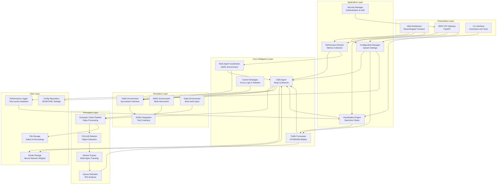
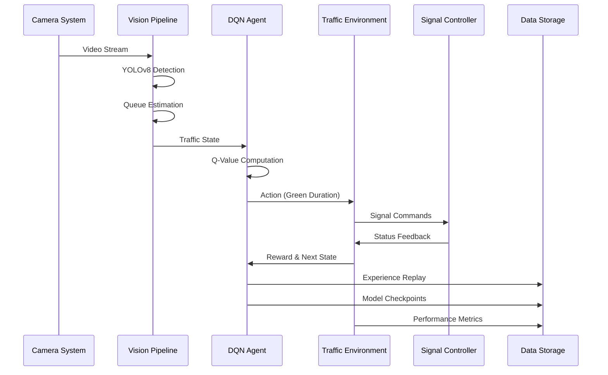
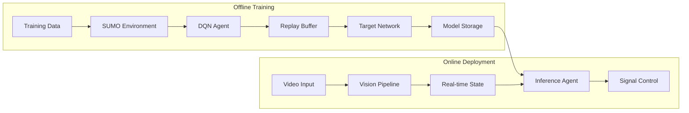
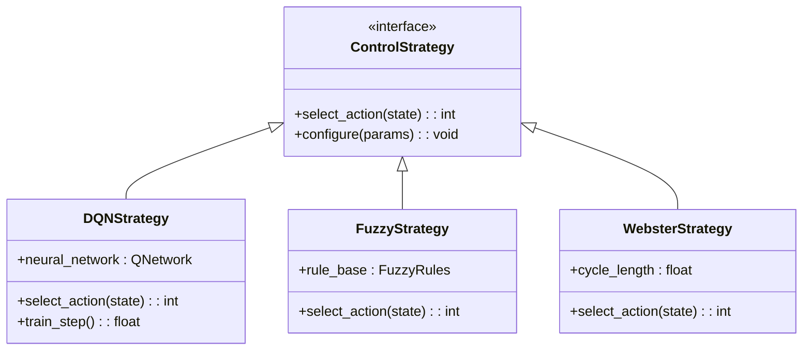
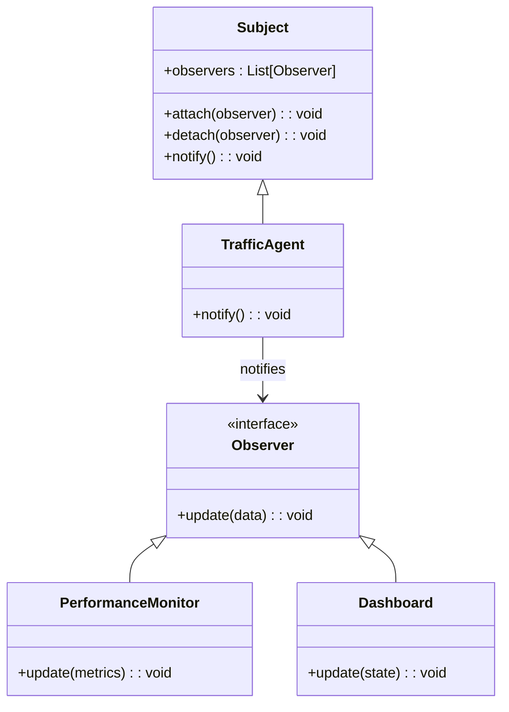
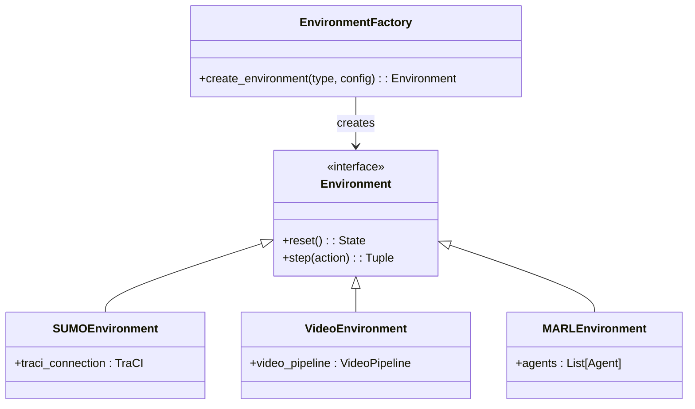
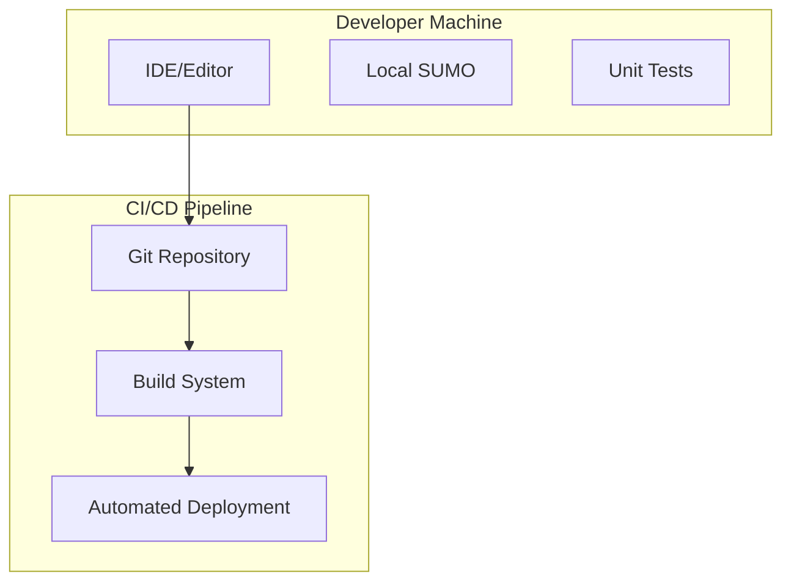
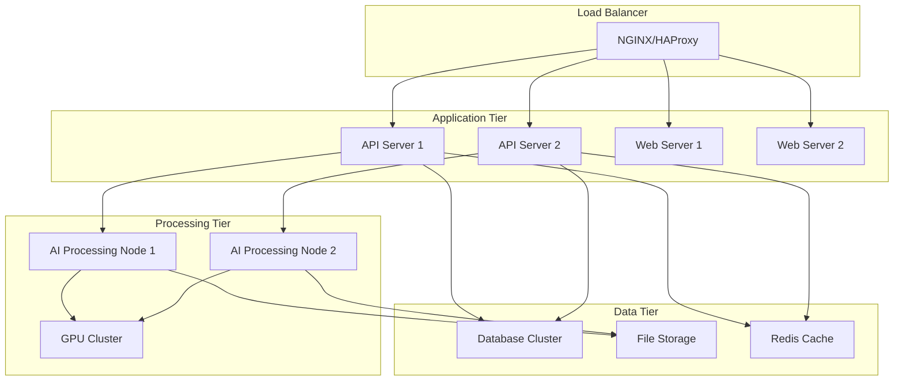

# High-Level Architecture Design - Adaptive Traffic Signal Control System

This document provides a comprehensive architectural overview of the Adaptive Traffic Signal Control System, detailing the layered structure, component interactions, and design patterns that enable intelligent traffic management through deep reinforcement learning and computer vision.

## Architecture Overview

The system follows a modular, layered architecture that separates concerns across six distinct layers, enabling scalability, maintainability, and extensibility. Each layer encapsulates specific responsibilities while providing well-defined interfaces to adjacent layers.

## Six-Layer Architecture Diagram

## Layer-by-Layer Architecture

### 1. Presentation Layer
**Purpose**: User interfaces and external system integration
- **Web Dashboard**: React/Angular-based interface for monitoring and control
- **REST API Gateway**: FastAPI-based service for external integrations
- **CLI Interface**: Command-line tools for system administration

**Key Components**:
- Real-time traffic visualization
- Performance metrics dashboards
- Configuration management interfaces
- System health monitoring
- Alert and notification systems

### 2. Application Layer
**Purpose**: Application services and cross-cutting concerns
- **Performance Monitor**: Real-time metrics collection and analysis
- **Configuration Manager**: Centralized system configuration management
- **Visualization Engine**: Chart generation and data presentation
- **Security Manager**: Authentication, authorization, and audit logging

**Key Features**:
- Multi-tenant configuration support
- Role-based access control
- Performance analytics and reporting
- System health checks and alerting

### 3. Core Intelligence Layer
**Purpose**: Decision-making and control algorithms
- **DQN Agent**: Deep Q-Network for adaptive signal control
- **Multi-Agent Coordinator**: Coordination across multiple intersections
- **Traffic Forecaster**: LSTM/GNN models for traffic prediction
- **Control Strategies**: Traditional methods (fuzzy logic, Webster method)

**Key Algorithms**:
- Deep Reinforcement Learning (DQN, Double DQN)
- Multi-Agent Reinforcement Learning (MARL)
- Time-series forecasting (CNN-LSTM hybrid)
- Graph Neural Networks for spatial traffic modeling
- Fuzzy logic control systems

### 4. Perception Layer
**Purpose**: Real-world data acquisition and processing
- **Computer Vision Pipeline**: Multi-threaded video processing
- **YOLOv8 Detector**: Real-time vehicle detection
- **Vehicle Tracker**: Multi-object tracking across frames
- **Queue Estimator**: Vehicle count estimation in ROIs

**Capabilities**:
- Multi-source video input (webcam, RTSP, file)
- Real-time object detection and tracking
- Region of Interest (ROI) configuration
- Queue length estimation and smoothing

### 5. Simulation Layer
**Purpose**: Training and testing environments
- **Traffic Environment**: Base Gymnasium environment
- **SUMO Integration**: Microscopic traffic simulation
- **MARL Environment**: Multi-agent training environment
- **Video Environment**: Real-world video integration

**Environment Types**:
- Single-intersection simulation
- Multi-intersection coordination
- Real-world video-based control
- Hybrid simulation-reality testing

### 6. Data Layer
**Purpose**: Data persistence and storage management
- **Performance Logger**: Time-series metrics storage
- **Model Storage**: Neural network weights and checkpoints
- **Config Repository**: System configuration persistence
- **File Storage**: Video recordings and data files

**Storage Systems**:
- Time-series databases for metrics
- File-based model checkpoints
- JSON/YAML configuration files
- Video and image file storage

## Component Interaction Patterns

### Data Flow Architecture

### Training Pipeline

## Design Patterns and Principles

### 1. Layered Architecture Pattern
- **Separation of Concerns**: Each layer has distinct responsibilities
- **Loose Coupling**: Layers interact through well-defined interfaces
- **High Cohesion**: Related components are grouped within layers

### 2. Strategy Pattern
Multiple control strategies (DQN, fuzzy logic, Webster method) implementing a common interface:

### 3. Observer Pattern
For real-time monitoring and event handling:

### 4. Factory Pattern
For environment creation and configuration:

## Technology Stack by Layer

### Presentation Layer
- **Frontend**: React/Angular, D3.js for visualization
- **API Gateway**: FastAPI, Uvicorn
- **CLI**: Click, Rich for formatting

### Application Layer
- **Monitoring**: Prometheus, Grafana
- **Configuration**: Pydantic, YAML/JSON
- **Security**: OAuth2, JWT tokens
- **Logging**: Python logging, structured logs

### Core Intelligence Layer
- **Deep Learning**: PyTorch, TensorFlow
- **Reinforcement Learning**: Custom DQN implementation
- **Time Series**: LSTM, GRU networks
- **Graph Learning**: PyTorch Geometric

### Perception Layer
- **Computer Vision**: OpenCV, YOLOv8
- **Object Detection**: Ultralytics YOLO
- **Tracking**: DeepSORT, ByteTrack
- **Image Processing**: NumPy, PIL

### Simulation Layer
- **Traffic Simulation**: SUMO, TraCI
- **RL Environment**: Gymnasium (OpenAI Gym)
- **Multi-threading**: Python threading, asyncio

### Data Layer
- **Databases**: SQLite, InfluxDB for time-series
- **File Storage**: Local filesystem, cloud storage
- **Serialization**: Pickle, JSON, HDF5

## Scalability and Performance Considerations

### Horizontal Scaling
- **Microservices**: Each layer can be deployed independently
- **Load Balancing**: API gateway distributes requests
- **Container Orchestration**: Docker, Kubernetes support

### Vertical Scaling
- **GPU Acceleration**: CUDA support for neural networks
- **Multi-threading**: Parallel video processing
- **Memory Optimization**: Efficient data structures and caching

### Performance Optimization
- **Model Optimization**: Quantization, pruning for inference
- **Caching**: Redis for frequently accessed data
- **Async Processing**: Non-blocking I/O operations

## Security Architecture

### Authentication & Authorization
- **Multi-factor Authentication**: Support for MFA
- **Role-based Access Control**: Granular permissions
- **API Key Management**: Secure token generation

### Data Security
- **Encryption**: Data at rest and in transit
- **Input Validation**: Sanitization of all inputs
- **Audit Logging**: Comprehensive activity tracking

### Network Security
- **TLS/SSL**: Encrypted communications
- **Rate Limiting**: DDoS protection
- **CORS Configuration**: Secure cross-origin requests

## Deployment Architecture

### Development Environment

### Production Environment

## Quality Attributes

### Maintainability
- **Modular Design**: Clear separation of concerns
- **Documentation**: Comprehensive code and API documentation
- **Testing**: Unit, integration, and system tests

### Reliability
- **Fault Tolerance**: Graceful degradation on component failure
- **Redundancy**: Multiple instances of critical components
- **Monitoring**: Real-time health checks and alerting

### Performance
- **Response Time**: Sub-second decision making
- **Throughput**: High-frequency video processing
- **Scalability**: Linear scaling with additional resources

### Security
- **Authentication**: Secure user management
- **Authorization**: Fine-grained access control
- **Data Protection**: Encryption and secure storage

This architecture provides a robust, scalable foundation for intelligent traffic management while maintaining flexibility for future enhancements and integration with smart city infrastructure.