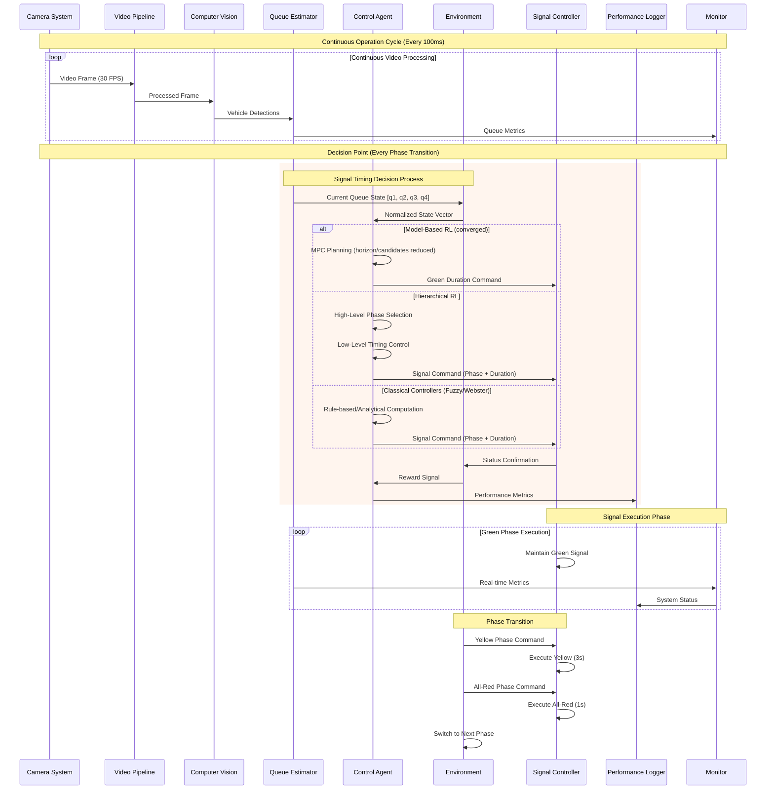
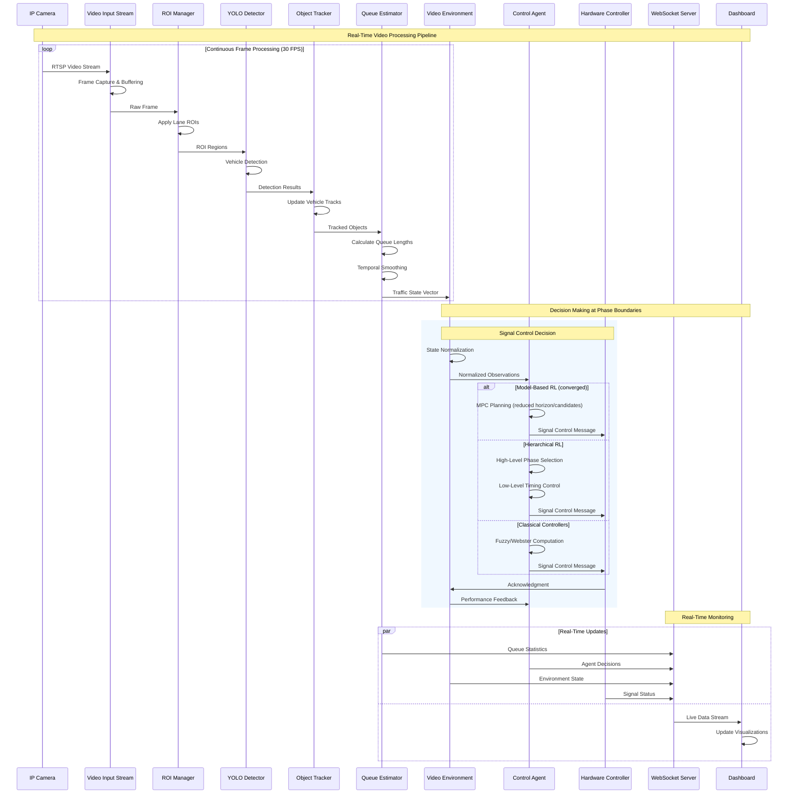
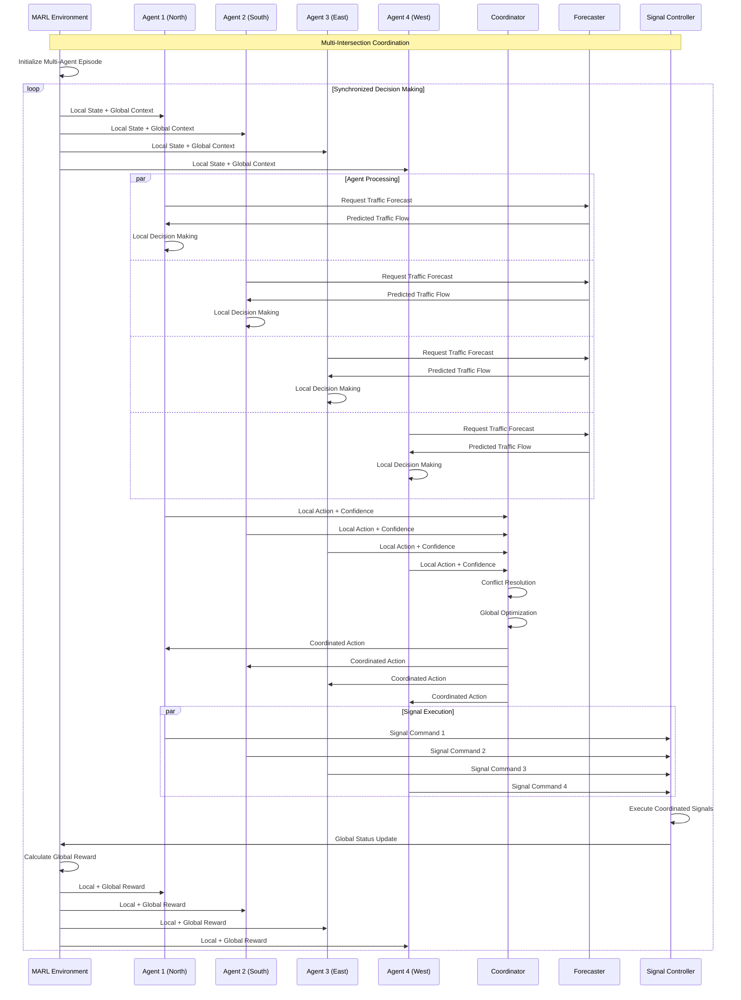
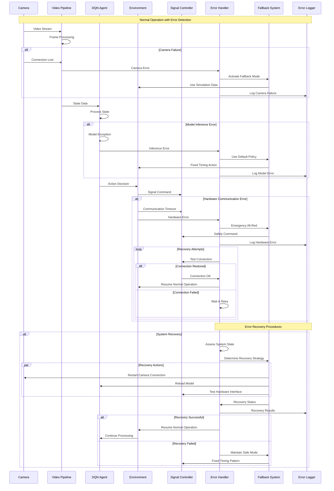
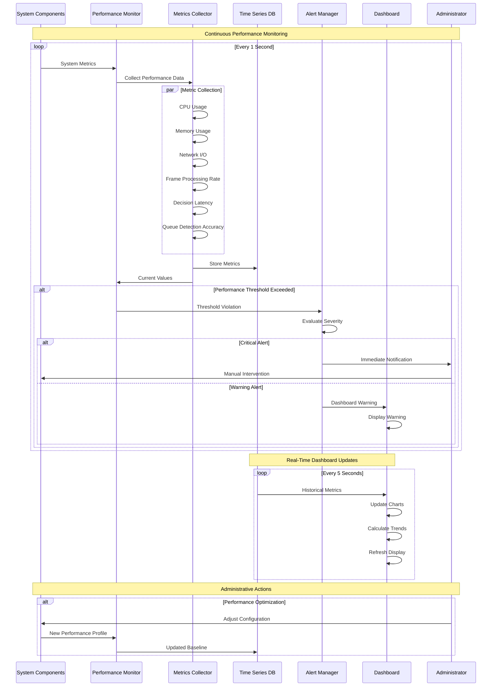

# Sequence Diagram - Adaptive Traffic Signal Control System

This document provides comprehensive Sequence Diagrams for the Adaptive Traffic Signal Control System, illustrating the temporal interactions between components during signal timing decisions, including real-time processing, training workflows, and error handling scenarios.

## Overview

The signal timing decision process involves complex temporal interactions between multiple components: cameras, computer vision processing, queue estimation, DQN agents, environments, signal controllers, and monitoring systems. The sequence diagrams show how these components coordinate during different operational modes.

## Main Signal Timing Decision Sequence



## Training Mode Sequence Diagram

```mermaid
sequenceDiagram
    participant ENV as Training Environment
    participant DQN as DQN Agent
    participant RB as Replay Buffer
    participant TN as Target Network
    participant OPT as Optimizer
    participant EVAL as Evaluator
    participant SAVE as Model Saver
    participant TB as TensorBoard

    Note over ENV, TB: Training Episode Initialization
    ENV->>ENV: Reset Environment
    ENV->>DQN: Initial State Vector
    
    loop Training Step (Until Episode End)
        DQN->>DQN: State Processing
        DQN->>DQN: ε-Greedy Action Selection
        DQN->>ENV: Selected Action
        
        ENV->>ENV: Environment Step
        ENV->>ENV: Reward Calculation
        ENV->>DQN: Next State + Reward + Done
        
        DQN->>RB: Store Experience (s, a, r, s', done)
        
        alt Training Condition Met
            DQN->>RB: Sample Batch
            RB->>DQN: Training Batch
            DQN->>DQN: Compute Q-targets
            TN->>DQN: Target Q-values
            DQN->>OPT: Compute Loss & Gradients
            OPT->>DQN: Update Parameters
            DQN->>TB: Training Metrics
        end
        
        alt Target Network Update
            DQN->>TN: Copy Parameters
            TN->>TB: Update Confirmation
        end
        
        alt Evaluation Episode
            DQN->>EVAL: Current Policy
            EVAL->>ENV: Evaluation Run
            ENV->>EVAL: Performance Results
            EVAL->>TB: Evaluation Metrics
        end
        
        alt Save Checkpoint
            DQN->>SAVE: Model Parameters
            SAVE->>SAVE: Save to Disk
            SAVE->>TB: Save Confirmation
        end
    end
    
    Note over ENV, TB: Episode Completion
    ENV->>TB: Episode Statistics
    DQN->>TB: Learning Progress
```

## Video-Based Real-Time Decision Sequence



## Multi-Agent Coordination Sequence



## Error Handling and Recovery Sequence



## Performance Monitoring Sequence



## Timing Analysis and Performance Requirements

### Real-Time Constraints

| **Component** | **Processing Time** | **Frequency** | **Latency Requirement** |
|---------------|-------------------|---------------|------------------------|
| **Frame Capture** | 33ms | 30 FPS | < 50ms |
| **YOLO Detection** | 50ms | 20 FPS | < 100ms |
| **Queue Estimation** | 10ms | 30 FPS | < 20ms |
| **DQN Inference** | 5ms | On-demand | < 10ms |
| **Signal Command** | 2ms | On-demand | < 5ms |
| **Total Decision** | ~100ms | Per phase | < 200ms |

### Sequence Timing Patterns

```yaml
# Timing Configuration for Sequence Interactions
timing_patterns:
  continuous_processing:
    frame_interval: 33ms        # 30 FPS
    detection_interval: 50ms    # 20 FPS  
    queue_update: 100ms         # 10 Hz
    
  decision_making:
    state_preparation: 5ms
    neural_network: 5ms
    action_selection: 1ms
    command_transmission: 2ms
    total_decision_time: 13ms
    
  training_cycles:
    experience_storage: 1ms
    batch_sampling: 10ms
    forward_pass: 5ms
    backward_pass: 15ms
    parameter_update: 5ms
    total_training_step: 36ms
    
  error_recovery:
    error_detection: 100ms
    fallback_activation: 50ms
    recovery_attempt: 1000ms
    system_restart: 5000ms
```

### Component Interaction Patterns

```python
class SequenceOrchestrator:
    """Orchestrates component interactions for signal timing decisions."""
    
    def __init__(self):
        self.timing_constraints = {
            'frame_processing': 100,  # ms
            'decision_making': 50,    # ms
            'signal_execution': 20,   # ms
        }
        self.component_states = {}
        
    async def execute_decision_sequence(self):
        """Execute the main decision sequence with timing constraints."""
        start_time = time.time()
        
        # Step 1: Gather current state
        queue_state = await self.get_queue_state()
        
        # Step 2: Agent decision making
        action = await self.agent_decision(queue_state)
        
        # Step 3: Execute signal command
        await self.execute_signal_command(action)
        
        # Step 4: Log performance
        total_time = (time.time() - start_time) * 1000
        await self.log_sequence_performance(total_time)
        
    async def monitor_sequence_timing(self):
        """Monitor and ensure sequence timing requirements."""
        while True:
            performance = await self.collect_timing_metrics()
            if performance.decision_latency > self.timing_constraints['decision_making']:
                await self.trigger_performance_alert()
            await asyncio.sleep(1.0)
```

This comprehensive sequence diagram documentation provides detailed temporal views of how the adaptive traffic signal control system coordinates its components to make intelligent timing decisions while maintaining real-time performance requirements and handling various operational scenarios.