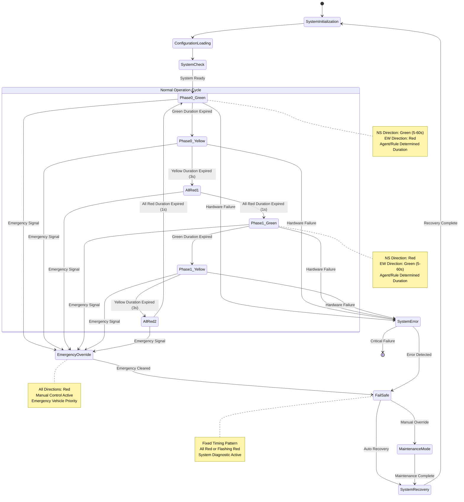
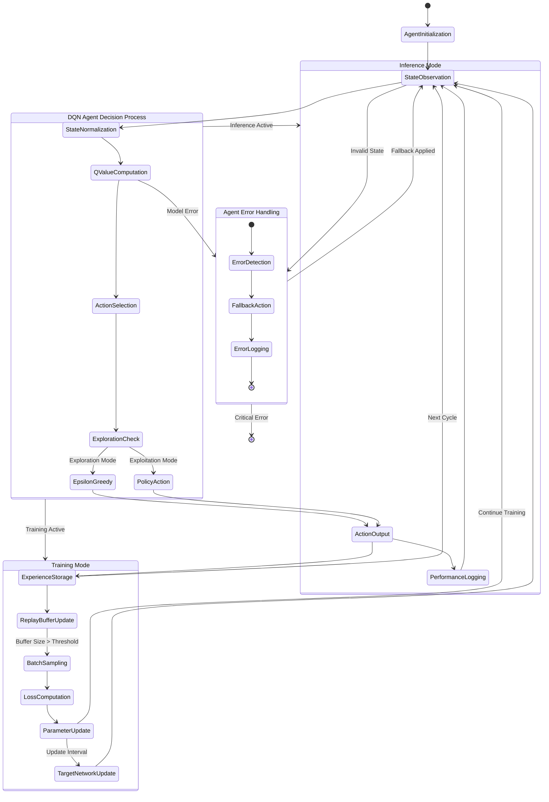
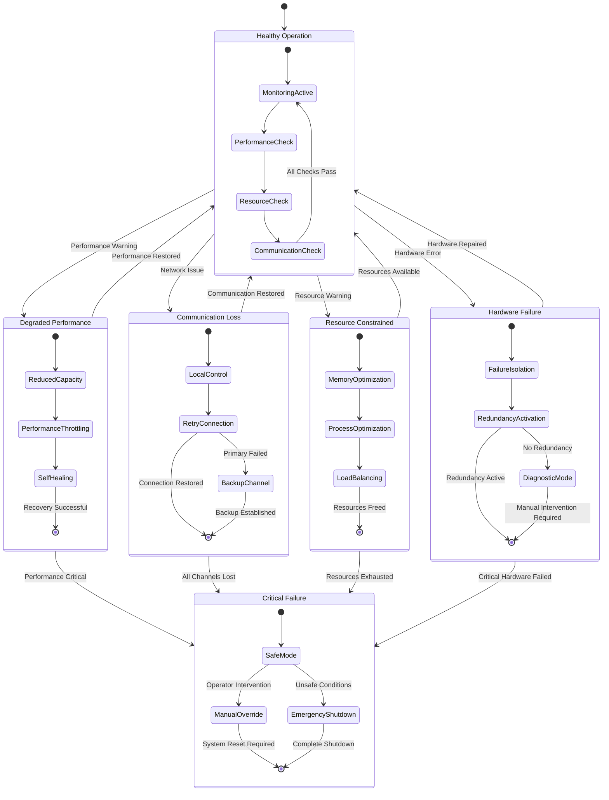
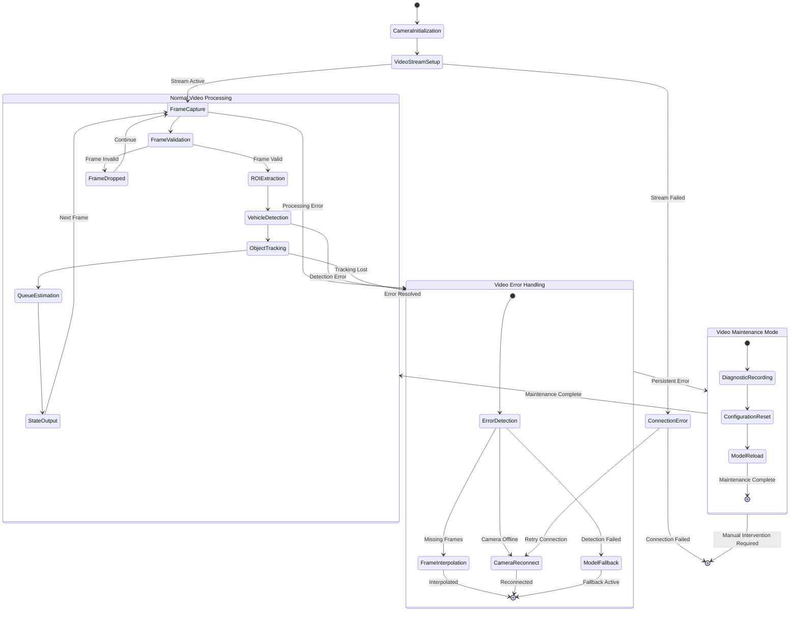

# State Diagram - Adaptive Traffic Signal Control System

This document provides comprehensive State Diagrams for the Adaptive Traffic Signal Control System, illustrating the state transitions for traffic signal control including normal operations, emergency overrides, failure modes, and recovery procedures.

## System State Overview

The traffic signal control system operates as a finite state machine with clearly defined states and transitions. The system manages traffic flow through cyclic phase transitions while handling emergency conditions, system failures, and maintenance operations.

## Main Signal Control State Diagram



## Detailed Phase Transition State Machine

```mermaid
stateDiagram-v2
    [*] --> Initialization
    
    state "Initialization States" as InitStates {
        Initialization --> LoadConfiguration
        LoadConfiguration --> ValidateHardware
        ValidateHardware --> CalibrateDetectors
        CalibrateDetectors --> SetInitialPhase
    }
    
    SetInitialPhase --> NorthSouthGreen
    
    state "Phase 0: North-South Green" as NorthSouthGreen {
        [*] --> NSGreenStart
        NSGreenStart --> NSGreenActive : Start Timer
        NSGreenActive --> NSGreenExtend : Queue Detected
        NSGreenActive --> NSGreenEnd : Timer Expired
        NSGreenExtend --> NSGreenEnd : Max Extension Reached
        NSGreenEnd --> [*]
    }
    
    NorthSouthGreen --> TransitionToYellow1 : Phase Complete
    
    state "Yellow Phase 1" as TransitionToYellow1 {
        [*] --> YellowStart1
        YellowStart1 --> YellowActive1 : 3 Second Timer
        YellowActive1 --> YellowEnd1 : Timer Expired
        YellowEnd1 --> [*]
    }
    
    TransitionToYellow1 --> AllRedClearance1 : Yellow Complete
    
    state "All Red Clearance 1" as AllRedClearance1 {
        [*] --> AllRedStart1
        AllRedStart1 --> AllRedActive1 : 1 Second Timer
        AllRedActive1 --> AllRedEnd1 : Timer Expired
        AllRedEnd1 --> [*]
    }
    
    AllRedClearance1 --> EastWestGreen : Clearance Complete
    
    state "Phase 1: East-West Green" as EastWestGreen {
        [*] --> EWGreenStart
        EWGreenStart --> EWGreenActive : Start Timer
        EWGreenActive --> EWGreenExtend : Queue Detected
        EWGreenActive --> EWGreenEnd : Timer Expired
        EWGreenExtend --> EWGreenEnd : Max Extension Reached
        EWGreenEnd --> [*]
    }
    
    EastWestGreen --> TransitionToYellow2 : Phase Complete
    
    state "Yellow Phase 2" as TransitionToYellow2 {
        [*] --> YellowStart2
        YellowStart2 --> YellowActive2 : 3 Second Timer
        YellowActive2 --> YellowEnd2 : Timer Expired
        YellowEnd2 --> [*]
    }
    
    TransitionToYellow2 --> AllRedClearance2 : Yellow Complete
    
    state "All Red Clearance 2" as AllRedClearance2 {
        [*] --> AllRedStart2
        AllRedStart2 --> AllRedActive2 : 1 Second Timer
        AllRedActive2 --> AllRedEnd2 : Timer Expired
        AllRedEnd2 --> [*]
    }
    
    AllRedClearance2 --> NorthSouthGreen : Cycle Complete
    
    %% Emergency and Error Transitions
    NorthSouthGreen --> EmergencyAllRed : Emergency Preemption
    EastWestGreen --> EmergencyAllRed : Emergency Preemption
    TransitionToYellow1 --> EmergencyAllRed : Emergency Preemption
    TransitionToYellow2 --> EmergencyAllRed : Emergency Preemption
    
    state "Emergency All Red" as EmergencyAllRed {
        [*] --> EmergencyActive
        EmergencyActive --> EmergencyHold : Emergency Vehicle Detected
        EmergencyHold --> EmergencyActive : Emergency Vehicle Passed
        EmergencyActive --> [*] : Emergency Cleared
    }
    
    EmergencyAllRed --> NorthSouthGreen : Return to Normal
```



## Agent Decision State Machine



## System Health and Monitoring States



## Video Processing Pipeline States



## State Transition Conditions and Actions

### Normal Operation Transitions

| **Current State** | **Condition** | **Action** | **Next State** |
|-------------------|---------------|------------|-----------------|
| Phase0_Green | Timer Expired OR Agent Decision | Set Yellow Lights | Phase0_Yellow |
| Phase0_Green | Max Green Reached (60s) | Force Yellow Transition | Phase0_Yellow |
| Phase0_Yellow | 3 Seconds Elapsed | Set All Red | AllRed1 |
| AllRed1 | 1 Second Elapsed | Switch Phase Index | Phase1_Green |
| Phase1_Green | Timer Expired OR Agent Decision | Set Yellow Lights | Phase1_Yellow |
| Phase1_Yellow | 3 Seconds Elapsed | Set All Red | AllRed2 |
| AllRed2 | 1 Second Elapsed | Switch Phase Index | Phase0_Green |

### Emergency and Error Transitions

| **Current State** | **Condition** | **Action** | **Next State** |
|-------------------|---------------|------------|-----------------|
| Any Normal State | Emergency Preemption | Immediate All Red | EmergencyOverride |
| Any Normal State | Hardware Failure | Activate Failsafe | SystemError |
| Any Normal State | Communication Loss | Local Control Mode | DegradedPerformance |
| EmergencyOverride | Emergency Cleared | Resume Normal Timing | Previous State |
| SystemError | Auto Recovery Possible | Restart Sequence | SystemRecovery |
| SystemError | Critical Failure | Manual Intervention | MaintenanceMode |

### Agent Decision Transitions

| **Agent State** | **Condition** | **Action** | **Next State** |
|-----------------|---------------|------------|-----------------|
| StateObservation | Valid State Vector | Normalize Observations | QValueComputation |
| QValueComputation | Model Available | Forward Pass | ActionSelection |
| ActionSelection | ε > random() | Random Action | EpsilonGreedy |
| ActionSelection | ε < random() | Greedy Action | PolicyAction |
| ExperienceStorage | Training Mode | Store in Buffer | ReplayBufferUpdate |
| ExperienceStorage | Inference Mode | Log Performance | PerformanceLogging |

## State Machine Configuration Parameters

```yaml
# Signal Timing Configuration
signal_timing:
  min_green_duration: 5      # seconds
  max_green_duration: 60     # seconds
  green_step: 5              # second increments
  yellow_duration: 3         # seconds
  all_red_duration: 1        # seconds
  
# Emergency Parameters
emergency:
  preemption_delay: 0        # immediate response
  emergency_clearance: 5     # seconds all red
  recovery_time: 10          # seconds to resume normal
  
# Error Handling
error_handling:
  retry_attempts: 3
  timeout_duration: 30       # seconds
  fallback_cycle: 90         # seconds fixed timing
  
# Agent Parameters
agent:
  epsilon_start: 1.0
  epsilon_end: 0.05
  epsilon_decay: 20000       # steps
  training_frequency: 4      # steps
  target_update: 1000        # steps
  
# Video Processing
video:
  frame_timeout: 100         # milliseconds
  detection_confidence: 0.5
  tracking_max_missing: 15   # frames
  queue_smoothing: 3         # frames
```

## State Machine Implementation

### Phase Management Class

```python
class SignalPhaseManager:
    """Manages traffic signal phase transitions and state machine logic."""
    
    def __init__(self, config):
        self.config = config
        self.current_state = "Initialization"
        self.current_phase = 0
        self.phase_start_time = 0
        self.green_duration = config.min_green
        self.emergency_active = False
        self.error_state = False
        
    def update_state(self, action: int, current_time: int):
        """Update state machine based on agent action and timing."""
        if self.emergency_active:
            return self._handle_emergency()
        
        if self.error_state:
            return self._handle_error()
            
        return self._handle_normal_operation(action, current_time)
    
    def _handle_normal_operation(self, action: int, current_time: int):
        """Handle normal phase transitions."""
        elapsed = current_time - self.phase_start_time
        
        if self.current_state == "Phase0_Green":
            if elapsed >= self.green_duration:
                self.current_state = "Phase0_Yellow"
                self.phase_start_time = current_time
                return "yellow"
                
        elif self.current_state == "Phase0_Yellow":
            if elapsed >= self.config.yellow:
                self.current_state = "AllRed1"
                self.phase_start_time = current_time
                return "all_red"
                
        elif self.current_state == "AllRed1":
            if elapsed >= self.config.all_red:
                self.current_state = "Phase1_Green"
                self.current_phase = 1
                self.green_duration = self._action_to_duration(action)
                self.phase_start_time = current_time
                return "green"
        
        # Similar logic for Phase1 states...
        
    def trigger_emergency(self):
        """Trigger emergency preemption."""
        self.emergency_active = True
        self.current_state = "EmergencyOverride"
        return "emergency_all_red"
        
    def clear_emergency(self):
        """Clear emergency and return to normal operation."""
        self.emergency_active = False
        self.current_state = "Phase0_Green"
        self.current_phase = 0
        return "resume_normal"
```

### State Monitoring and Logging

```python
class StateMonitor:
    """Monitors state transitions and logs system behavior."""
    
    def __init__(self):
        self.state_history = []
        self.transition_counts = {}
        self.error_log = []
        
    def log_transition(self, from_state: str, to_state: str, 
                      trigger: str, timestamp: float):
        """Log state transition for analysis."""
        transition = {
            "from": from_state,
            "to": to_state,
            "trigger": trigger,
            "timestamp": timestamp
        }
        self.state_history.append(transition)
        
        # Count transitions
        transition_key = f"{from_state}->{to_state}"
        self.transition_counts[transition_key] = \
            self.transition_counts.get(transition_key, 0) + 1
    
    def get_state_statistics(self):
        """Get statistics about state machine behavior."""
        return {
            "total_transitions": len(self.state_history),
            "transition_counts": self.transition_counts,
            "error_count": len(self.error_log),
            "uptime_percentage": self._calculate_uptime()
        }
```

This comprehensive state diagram documentation provides a complete picture of how the adaptive traffic signal control system manages state transitions, handles errors, and maintains safe operation across all operational modes.