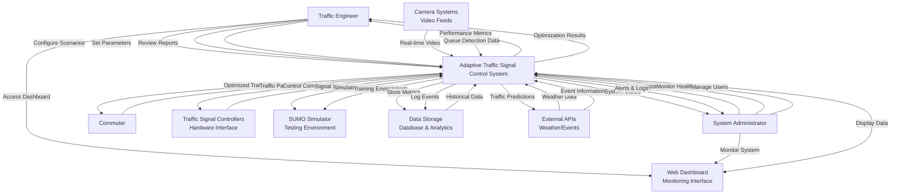

# System Context Diagram - Adaptive Traffic Signal Control System

This document provides the system context diagram illustrating the highest-level view of the Adaptive Traffic Signal Control System and its interactions with external entities.

## System Context Diagram

## System Components Description

### Core System
- **Adaptive Traffic Signal Control System**: The central intelligent system that processes inputs, makes decisions, and controls traffic signals using deep reinforcement learning, computer vision, and traffic forecasting.

### External Actors

#### Traffic Engineer
- **Role**: Domain expert responsible for traffic optimization and system configuration
- **Interactions**:
  - Configures traffic scenarios and system parameters
  - Reviews performance reports and optimization results
  - Sets reward functions and control policies
  - Analyzes traffic patterns and system effectiveness

#### System Administrator
- **Role**: Technical operator responsible for system deployment and maintenance
- **Interactions**:
  - Deploys and configures the system infrastructure
  - Monitors system health and performance
  - Manages user access and security
  - Responds to system alerts and maintains logs

#### Commuter
- **Role**: End beneficiary of the traffic optimization system
- **Interactions**:
  - Indirectly benefits from optimized traffic flow and reduced wait times
  - Generates traffic patterns through vehicle movement
  - Experiences improved traffic conditions without direct system interaction

### External Systems

#### Camera Systems
- **Purpose**: Provides real-time visual input for traffic analysis
- **Technology**: IP cameras, RTSP streams, video processing
- **Data Exchange**:
  - Sends real-time video feeds to the system
  - Provides queue detection and vehicle counting data
  - Supports ROI (Region of Interest) configuration

#### Traffic Signal Controllers
- **Purpose**: Physical hardware interface for signal control
- **Technology**: Industrial traffic signal controllers with communication protocols
- **Data Exchange**:
  - Receives control commands from the adaptive system
  - Reports current signal status and timing
  - Implements safety interlocks and manual overrides

#### SUMO Simulator
- **Purpose**: Microscopic traffic simulation for testing and training
- **Technology**: Open-source traffic simulation platform
- **Data Exchange**:
  - Provides realistic traffic simulation environment
  - Enables offline training of reinforcement learning agents
  - Supports scenario testing and validation

#### Data Storage
- **Purpose**: Persistent storage for metrics, logs, and historical data
- **Technology**: Time-series databases, data warehouses, analytics platforms
- **Data Exchange**:
  - Stores performance metrics and system events
  - Provides historical data for analysis and reporting
  - Supports data export for external analytics

#### Web Dashboard
- **Purpose**: User interface for monitoring and management
- **Technology**: Web-based dashboard with real-time visualization
- **Data Exchange**:
  - Displays system status and performance metrics
  - Provides configuration interface for operators
  - Shows real-time traffic conditions and predictions

#### External APIs
- **Purpose**: Integration with external data sources
- **Technology**: REST APIs, weather services, event management systems
- **Data Exchange**:
  - Receives weather data and special event information
  - Provides traffic predictions to external systems
  - Supports integration with smart city platforms

## Data Flow Summary

1. **Input Processing**: Camera systems provide real-time video feeds that are processed using computer vision (YOLOv8) to detect vehicle queues and traffic conditions.

2. **Decision Making**: The core system uses deep reinforcement learning (DQN) agents, traffic forecasting models, and control strategies to determine optimal signal timing.

3. **Signal Control**: Control commands are sent to traffic signal controllers to implement timing decisions and optimize traffic flow.

4. **Monitoring & Analytics**: All system activities are logged to data storage, and performance metrics are displayed through the web dashboard for operators.

5. **Training & Simulation**: SUMO simulator provides a safe environment for training and testing control strategies before deployment.

## Key Features

- **Real-time Processing**: Continuous processing of video feeds and traffic data
- **Adaptive Learning**: Self-improving system that learns from traffic patterns
- **Multi-modal Control**: Supports various control strategies (DQN, fuzzy logic, Webster method)
- **Comprehensive Monitoring**: Full observability with metrics, logging, and visualization
- **Scalable Architecture**: Modular design supporting single intersections to city-wide networks
- **Safety Integration**: Fail-safe mechanisms and manual override capabilities

This system context diagram provides the foundation for understanding how the Adaptive Traffic Signal Control System integrates with its environment and serves its stakeholders.